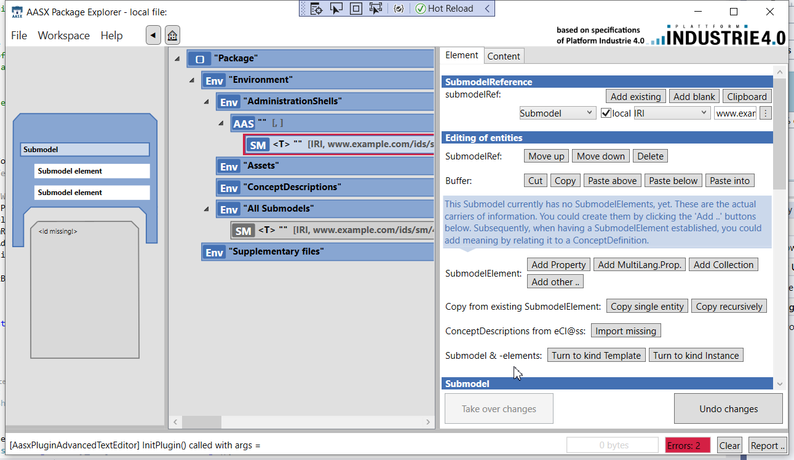
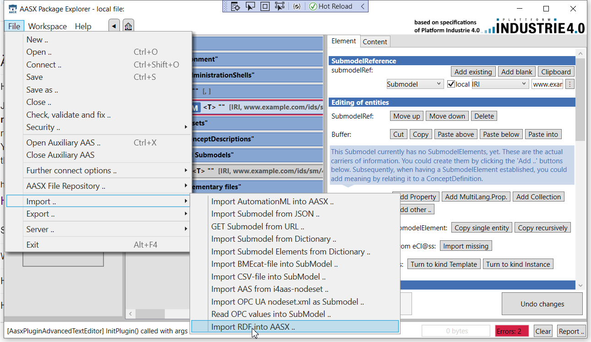
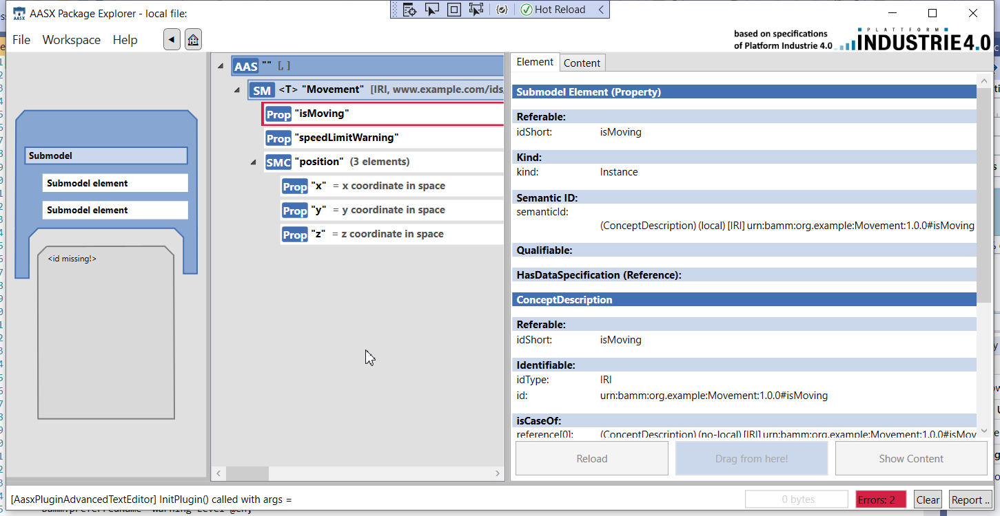

# AasxBammRdfImExport

AasxBammRdfImExport module imports the BAMM RDF (.ttl) files into the AASX Package Explorer. The current release version includes importing of BAMM Aspects, Properties and Entities.

## Getting Started

### Prerequisites

To use these functionalities, you need a running AASX Package Explorer. Refer [AASX Package Explorer](https://github.com/admin-shell-io/aasx-package-explorer/blob/master/README.md) for more information on the installation and the release.

### Packages Used

[dotNetRDF v2.0.0](https://dotnetrdf.org/).

## Usage

Follow the steps below to import your BAMM RDF file into the AASX Package Explorer. The current release version includes importing of BAMM Aspects, Properties and Entities.

1. In the Edit mode under Workspace, create an Asset Administration Shell (AAS).

2. In the AAS, create a new Submodel and save the Submodel as (.aasx) into the File explorer.

3. Select the created Submodel and go to `File > Import .. > Import BAMM RDF into AASX ..` and select the BAMM RDF file to be imported.

The BAMM Aspect should be successfully imported into the created AAS Submodel (like in the screenshot below).

Samples of BAMM RDF (.ttl) files are available to test the functionalities. You can find them [here](test).

Note: Please make sure you save the created Submodel by selecting it and clicking `File > Save As ..` before importing your BAMM RDF file is necessary.

## Copyright
Copyright (c) 2021-2022 Robert Bosch Manufacturing Solutions GmbH

## License
Distributed under the [Apache-2.0](https://spdx.org/licenses/Apache-2.0.html). See [LICENSE.txt](LICENSE.txt) for more information.