# Guided creation of submodels via aspect models

> **NOTE: The SAMM functionality and the corresponding extensions are in an experimental stage.**

## Table of Contents

- [Introduction](#introduction)
    - [Audience and Scope](#audience--scope)
    - [Terminology](#terminology)
	- [SAMM and ESMF](#samm--esmf)
		- [Semantic Aspect Meta Model](#semantic-aspect-meta-model)
		- [Eclipse Semantic Modeling Framework](#eclipse-semantic-modeling-framework)
		- [References for usage of SAMM and ESMF](#references)
		- [Examples](#examples)
- [AASX Package Explorer - Step by Step](#aasx-package-explorer-step-by-step)
	- [Import and View Aspect Model](#import-aspect-model)
	- [Creating a Submodel Instance](#creating-a-submodel-instance)
	- [Editing an Aspect Model](#editing-an-aspect-model)
	- [Export Aspect Model](#export-aspect-model)
- [Background on Implementation](#background-on-implementation)
	- [Data Specifications and Extensions](#data-specifications-and-extensions)
	- [SAMM Extensions](#samm-extensions)


## Introduction

### Audience and Scope

The scope of the document is to explain how to create submodels based on an aspect model defined conformant to the Semantic Aspect Meta Model (SAMM).

### Terminology


<a name="aspect">**Aspect**</a>

> a domain-specific view on information and functionality associated with
a specific [*Digital Twin*](#digital-twin) with a reference to a concrete [*Aspect Model*](#aspect-model).

Note 1 to entry: An Aspect is a software service to retrieve the actual
runtime data of a Digital Twin (current or aggregated) from a data
source or to trigger operations. Thus, an aspect is built with an
implementation that ensures that the exchanged data is compliant to the
specification of the referenced Aspect Model via a defined
interface.

Note 2 to entry: Aspects are registered (incl. their "API endpoint"
information) with the Digital Twin to which they belong in the
Digital Twin Registry.

Note 3 to entry: an aspect corresponds to a [*Submodel*](#submodel) in the [*Asset Administration Shell*](#asset-administration-shell)

*\[SOURCE: [Eclipse Semantic Modeling Framework (ESMF)]([https://projects.eclipse.org/projects/dt.esmf](https://eclipse-esmf.github.io/samm-specification/snapshot/index.html)), editorial changes and notes added \]*

<a name="aspect-model">**Aspect Model**</a>

> a formal, machine-readable semantic description (expressed with
RDF/turtle) of data accessible from an [*Aspect*](#aspect).

Note 1 to entry: An Aspect Model must adhere to the Semantic Aspect Meta
Model (SAMM), i.e., it utilizes elements and relations defined in the
Semantic Aspect Meta Model and is compliant with the validity rules
defined by the Semantic Aspect Meta Model. 

Note 2 to entry: Aspect models are logical data models which can be used
to detail a conceptual model in order to describe the semantics of
runtime data related to a concept. Further, elements of an Aspect model
can/should refer to terms of a standardized Business Glossary (if
existing).

Note 3 to entry: An Aspect Model describes the semantics of a [*Submodel*](#submodel).

*\[SOURCE: [Eclipse Semantic Modeling Framework (ESMF)]([https://projects.eclipse.org/projects/dt.esmf](https://eclipse-esmf.github.io/samm-specification/snapshot/index.html)), editorial changes and notes added \]*

<a name="AAS">**Asset Administration Shell**</a>

> standardized [*digital representation*](#digital-representation) of an asset

Note 1 to entry: Asset Administration Shell and Administration Shell are
used synonymously.

*\[SOURCE: IEC 63278-1, note added\]*


<a name="submodel-template">**Submodel Template**</a>

> guides the creation of a [*Submodel*](#submodel) conformant
to the [*Aspect Model*](#aspect-model) and the [*Asset Administration Shell*](#asset-administration-shell).

*\[SOURCE: IEC 63278-1, extracted from text plus correlation with aspect model added \]*

<a name="digital-twin">**Digital Twin**</a>

> [*digital representation*](#digital-representation), sufficient to meet the requirements of a set of
use cases

Note 1 to entry: in this context, the entity in the definition of
digital representation is typically an asset.

*\[SOURCE: IIC Vocabulary IIC:IIVOC:V2.3:20201025, adapted (an asset,
process, or system was changed to an asset)\]*


<a name="digital-representation">**Digital representation**</a>

> information and services representing an entity from a given viewpoint

EXAMPLE 1: examples of information are properties (e.g., maximum
temperature), actual parameters (e.g., actual velocity), events (e.g.,
notification of status change), schematics (electrical), and
visualization information (2D and 3D drawings).

EXAMPLE 2: examples of services are providing the history of the
configuration data, providing the actual velocity, and providing a
simulation.

EXAMPLE 3: examples of viewpoints are mechanical, electrical, or
commercial characteristics.

*\[SOURCE: IEC 63278-1, editorial changes\]*


<a name="submodel">**Submodel**</a>

> container of [*SubmodelElement*](#submodel-element)s defining a hierarchical structure
consisting of SubmodelElements

*\[SOURCE: IEC 63278-1\]*


<a name="submodel-element">**SubmodelElement**</a>

> elements in a [*Submodel*](#submodel)

*\[SOURCE: IEC 63278-1\]*


<a name="submodel-template">**Submodel template**</a>

> container of Submodel template elements defining a hierarchical
structure consisting of Submodel template elements

*\[SOURCE: IEC 63278-1, note removed\]*


### SAMM and ESMF

#### Eclipse Semantic Modeling Framework

The [Semantic Aspect Meta Model (SAMM)](https://github.com/eclipse-esmf/esmf-semantic-aspect-meta-model) is specified as an open standard
as integral part of the [Eclipse Semantic Modeling Framework (ESMF)](https://projects.eclipse.org/projects/dt.esmf).
This part again is part of the Top-Level Project [Eclipse Digital
Twin](ttps://projects.eclipse.org/projects/dt). The Eclipse Digital Twin Top-Level Project is a
collaborative, open-source initiative at the Eclipse Foundation
fostering the development of reference implementations for the
activities driven by the [Industrial Digital Twin
Association](https://industrialdigitaltwin.org) (IDTA).

The core of the Eclipse Semantic Modeling Framework is the development
of the Semantic Aspect Meta Model (SAMM). Besides the SAMM specifying
the language to define the semantics of a submodel in an ["Aspect
Model"](#aspect-model), the ESMF also includes an editor, SDKs in different programming
languages, a command line tool for validation, generating documentation
and different serializations and other functionality easing its usage
and implementation in digital twin projects. Also, aasx generators for
support of [Asset Administration Shell](#asset-administration-shell) are in scope.

Aspect Models express a schema with a defined Resource Description
Framework ([RDF](http://www.w3.org/TR/rdf11-concepts/)) vocabulary and are validated by a comprehensive
set of rules in the Shapes Constraint Language ([SHACL](https://www.w3.org/TR/shacl/)). Domain
semantics are captured by a combination of structural elements,
relations, namespaces and reified named concepts. 

The Eclipse Semantic Modeling Framework (ESMF) in combination with the
specifications of and open-source solutions for the Asset Administration
Shell accelerates the development of digital twin technologies and
drives its adoption in ecosystems.

#### Semantic Aspect Meta Model (SAMM)

The [Semantic Aspect Meta Model (SAMM)](https://eclipse-esmf.github.io/samm-specification/2.1.0/index.html) provides a set of predefined
objects that allow a domain expert to define aspect models and

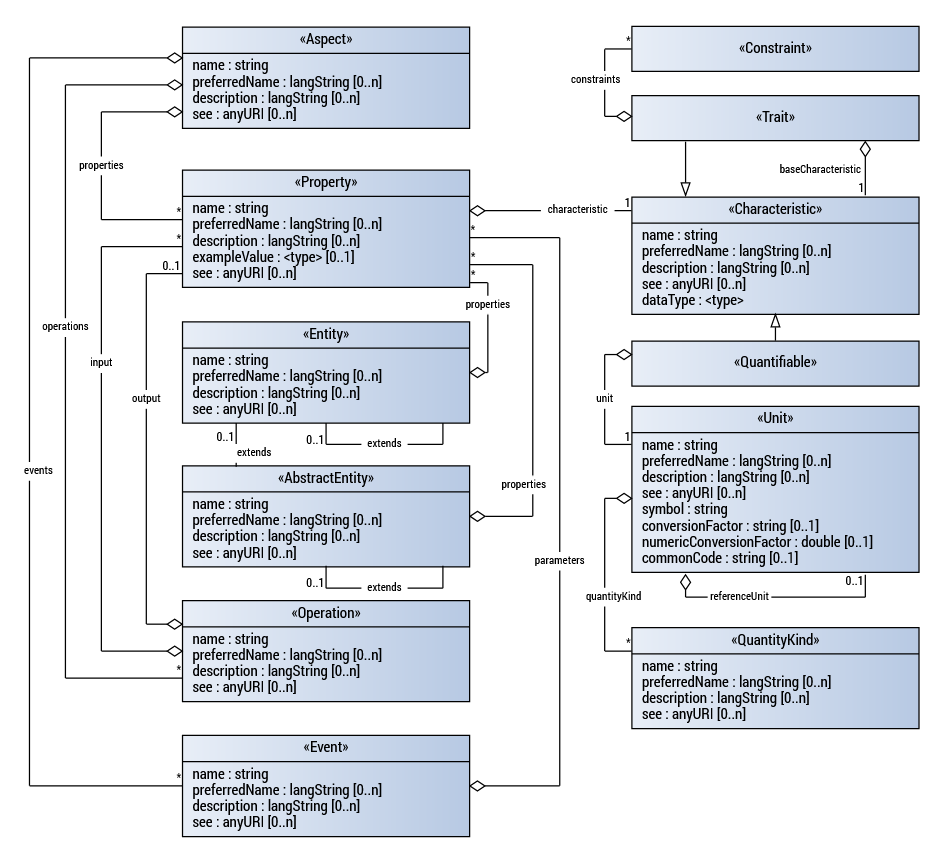

The complete specification and further information about its
implementation and requirements can be accessed via the [Eclipse Semantic Modeling Framework (ESMF)]([https://projects.eclipse.org/projects/dt.esmf](https://eclipse-esmf.github.io/samm-specification/snapshot/index.html)).

Every aspect model in
<https://github.com/eclipse-tractusx/sldt-semantic-models> that has
status "released" or "standardized" MUST be conformant to the
Semantic Aspect Meta Model.

Every new aspect model MUST be conformant to the version of the Semantic
Aspect Meta Model as noted in the [normative reference](#normative-references) [SAMM](#SAMM).

#### References for usage of SAMM and ESMF

Semantic Models conformant to the Semantic Aspect Model Metamodel are defined and standardized in [Catena-X]{https://catena-x.net/en/}. These semantic models are available via the CC-BY-4.0 license in github:
<https://github.com/eclipse-tractusx/sldt-semantic-models>.

#### Examples


An extract from a corresponding machine-readable specification of the
aspect model conformant to the Semantic Aspect Meta Model could look
like this:

```
:Movement a samm:Aspect ;
   samm:preferredName "movement"@en ;
   samm:description "Aspect for movement information"@en ;
   samm:properties ( :isMoving :position :speed :speedLimitWarning ) ;
   samm:operations ( ) ;
   samm:events ( ) .

:isMoving a samm:Property ;
   samm:preferredName "is moving"@en ;
   samm:description "Flag indicating whether the asset is currently moving"@en ;
   samm:characteristic samm-c:Boolean .
```


The [Movement.ttl](https://github.com/eclipse-esmf/esmf-aspect-model-editor/blob/main/core/apps/ame/src/assets/aspect-models/org.eclipse.examples/1.0.0/Movement.ttl) example in the "src/examples" folder is taken from the [Aspect Model Editor 5.0.0](https://github.com/eclipse-esmf/esmf-aspect-model-editor).

For more examples of aspect models conformant to the Semantic Aspect
Meta Model see
<https://github.com/eclipse-tractusx/sldt-semantic-models>.

## AASX Package Explorer - Step by Step

### Import and View an Aspect Model

For importing an existing aspect model use "File/Import .../Import SAMM aspect into ConceptDescriptions ...". 

Note: you should start with a new environment via "File/New ..." and switch to edit mode with"Workspace/Edit".

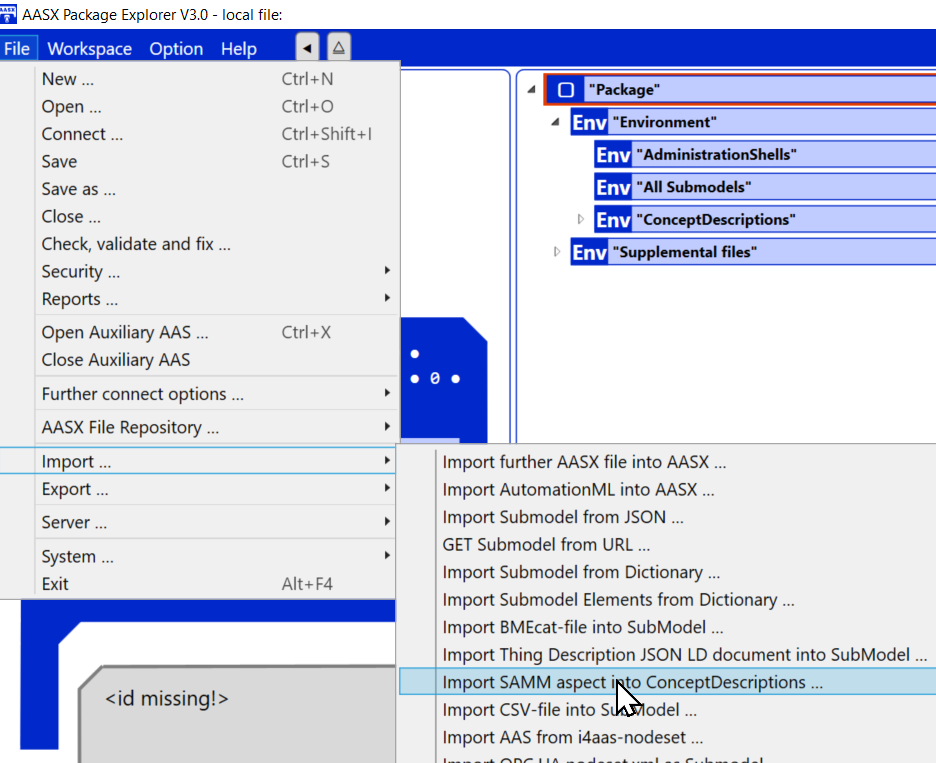

After Import all elements of the aspect models are represented as concept description with their unqiue ID.

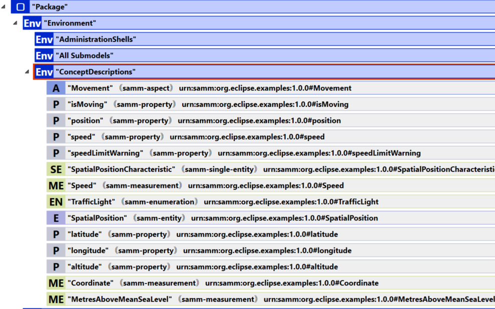

The coloring and nmaing of the different types of concept descriptions is aligend with the ESMF Aspect Model Editor.

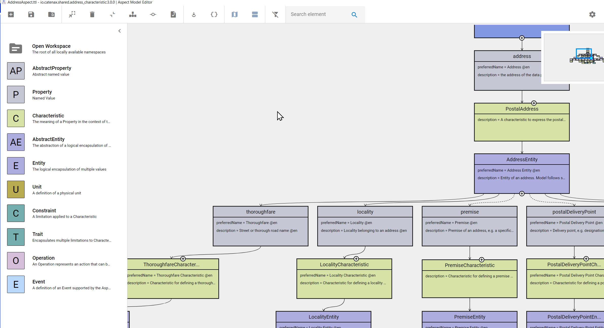

There are different views on the concept description supported by the AASX Package Explorer. For seeing the structure choose "Dynmaic Order" "structured":

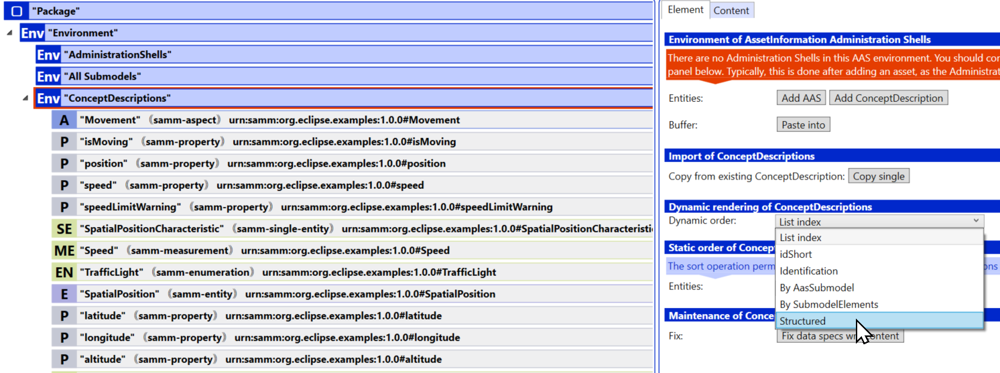

Please note that in the structured view elements that are used in several SAMM property elements etc. are contained several times. However, in the model they only exist once.

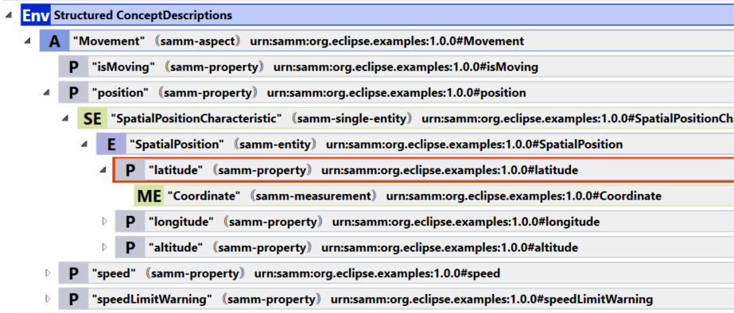


### Creating a Submodel Instance


It is possible to create a submodel based on an aspect model. Use "Workspace/Create .../New Submodel from SMT/SAMM Concept Description"

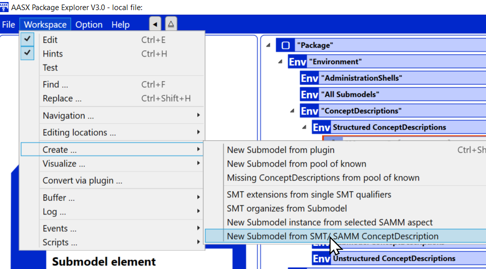

A list of all available concept description that can guide the creation of a submodel are shown. In this example there is only one concept description of kind "SAMM" that can be selected. 

The newly created submodel will have the ID of the selected semantic model as value of its semanticId

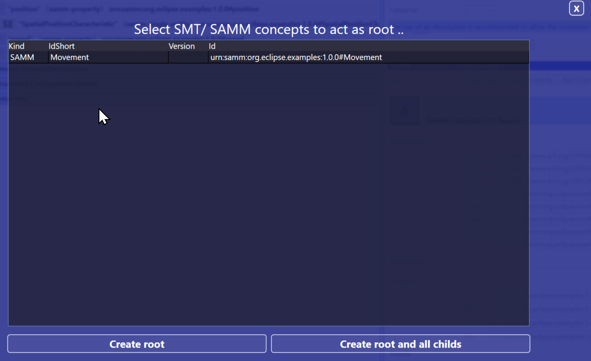

After selecting a submodel either all elements can be created at once including all optional elements ("Create root and all childs") or only the root ("Create root"). In the latter case the additional elements will be added one by one in a guided way. Only mandatory elements will be added at once.

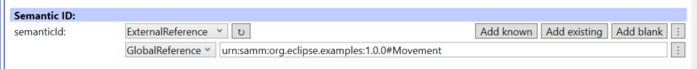


In the following we show the way when selecting the root only. 

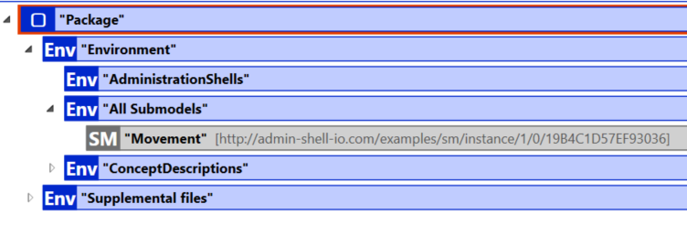

In the next step an Administration Shell should be created that references the newly created Submodel. Otherwise it is not visible in the AASX Package Explorer which elements will be added to the created Submodel in the next steps.

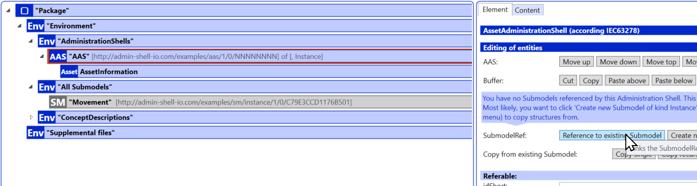

After referencing the submodel that was created in the previous step the submodel is visible with its mandatory elements of the first level. There still might be mandatory elements on deeper levels.

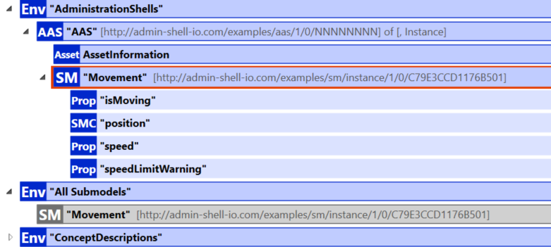

In a next step new elements can be added in a guided way by choosing SubmodelElement -> "Add SMT guided ...". In our example this is only relevant for the SubmodelElementCollection "position". Properies are atomic and no sub-elements can be added.

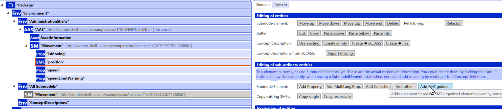

The list of all allowed elements conformant to the aspect model/SMT selected in the previous step is shown. The "Card." shows whether the element is optional ("[0..1]") or mandatory ("[1]"). The "Type" column shows which kind of SubmodelElement will be created. In the example "latitude" will be mapped to a SubmodelElement "Property.

Multi-Select is supported. It is strongley recommended to add all mandatory fields. The columns "Present" shows whether an element is already present ("1") (in this case do not add it twice) or not ("-").

Note: The aasx package explorer does not hinder to add fields several time or add additional properties not available in the aspect model. Validation will show whether the created submodel is valid and conformant to the semantic model selected.

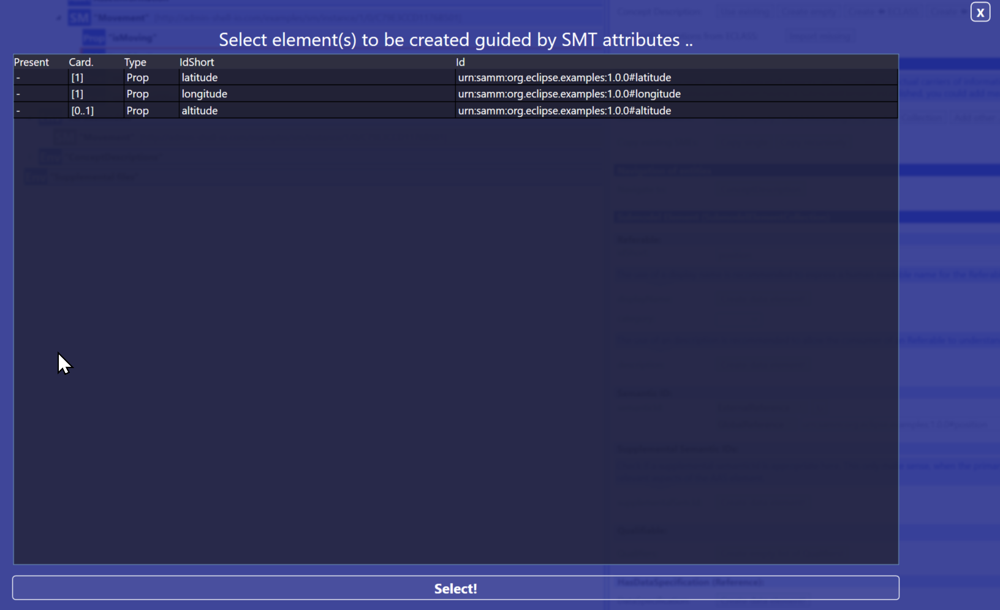

After selecting the elements (in our example only the mandatory fields were selected) they are created. As value the example value from the aspect model is inserted.

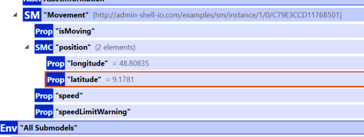


### Editing an Aspect Model

After adding a new Concept Description choose SAMM Extensions to model a new aspect model.

**Step 1) Add a new Concept Description**

**Step 2) Choose SAMM Extension**

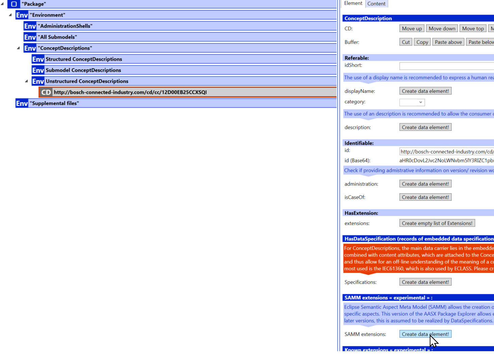

Clicking on "Add other" shows which SAMM element types are available to create and to edit.

**Step 3) Choose "Add other"**

**Step 4) Choose SAMM element type**

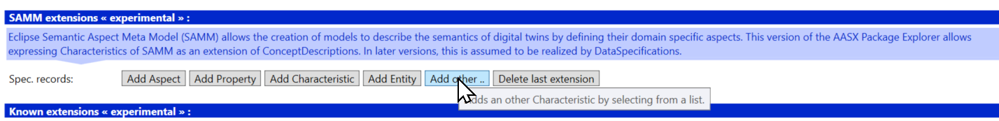

The list of SAMM element types contains not only all elements from the SAMM metamodel but also all predefined characteristics except for the basis ones like "bamm-c:Boolean" etc. because in this case the data type is added directly into the Concept Description and not into a new Concept Description.

*NOTE: per Concept Description please add only one SAMM Extension!*


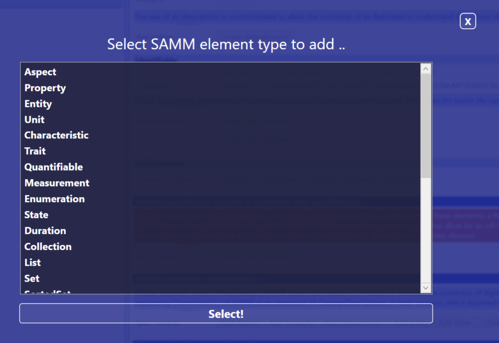

Click on the element you want to edit. In our example we start with modelling an aspect model "Movement".
Then select the version of the SAMM Aspect Metamodel that you need. In our example we select version 2.0.0.

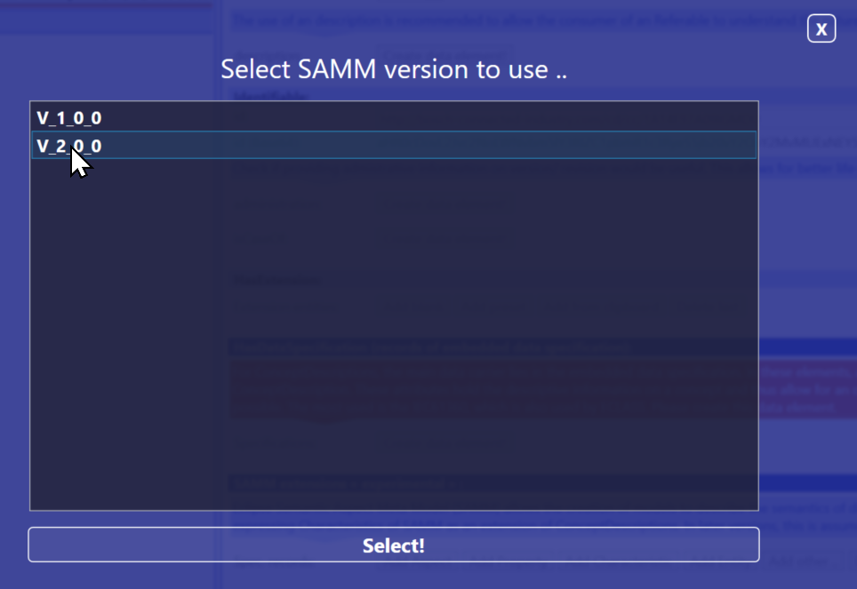

First we add the idShort and ID of the Concept Description. These two attributes are not part of the SAMM extension but common to all Concept Descriptions.

**Step 5) Edit attribute "id" of the Concept Description**

**Step 6) Edit attribute "idShort" of the Concept Description**


In a next step add the preferredName in the languages you want to support. In our example the preferred name is provided in English as "movement".

**Step 7) Edit attribute "preferredName" of the SAMM Extension**


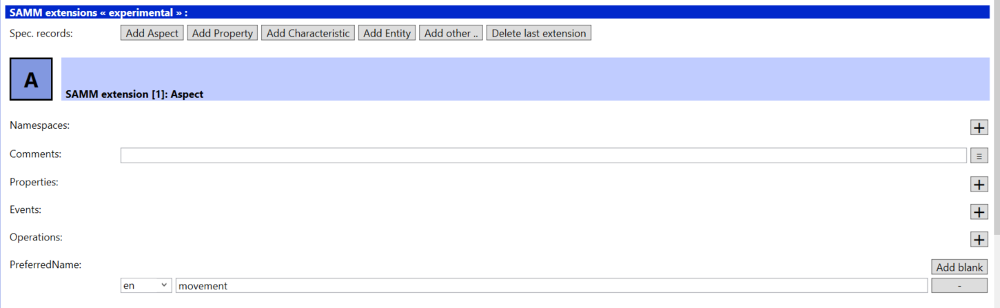

The ID consists of the namespace and the name of the model element. In our example the namespace of the model is "urn:samm:org.eclipse.examples:1.0.0#" and its name is "Movement".

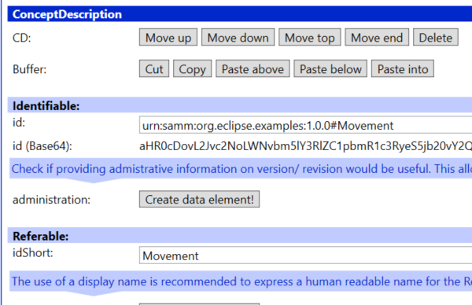

In a next step we add the properties "isMoving" and "position" to the aspect.

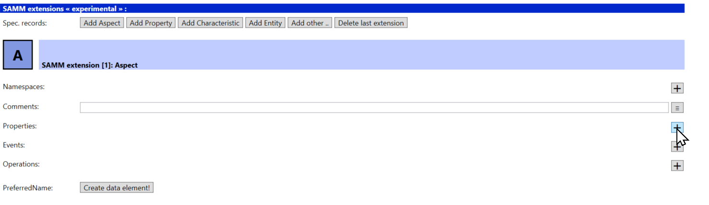

The IDs of the two properties need to be added. Add as many properties as needed. If a property is optional click on the Box "Opt." In our example the two properties "isMoving" and "position" are mandatory.

**Step 8) (Context:Aspect or Entity) Add Properties with their unique ID**

**Step 9) (Context:Aspect or Entity) Decide whether Property is optional**


Now we need to add the two newly defined properties "isMoving" and "position". "isMoving" has the basic predefined Characteristic "samm-c:Boolean" with data type "Boolean". "position" has the basic Characteristic "samm-c:SingleEntity". The namespace of samm-c is *urn:samm:org.eclipse.examples:1.0.0#*.

**Step 10) (Context:Property) Edit attribute "Characteristic": Either select predefined characteristic or create new characteristic. If constraints shall be added to the characteristic a trait needs to be created.**

We start Step 1) to Step 7) but this time choose the SAMM element type "Property". This Concept Description shall contain the information for the SAMM-property "isMoving". We select the predefined chacteristic "urn:samm:org.eclipse.esmf.samm:characteristic:2.0.0#Boolean" by selecting from the set of characteristics by clicking on "Preset".

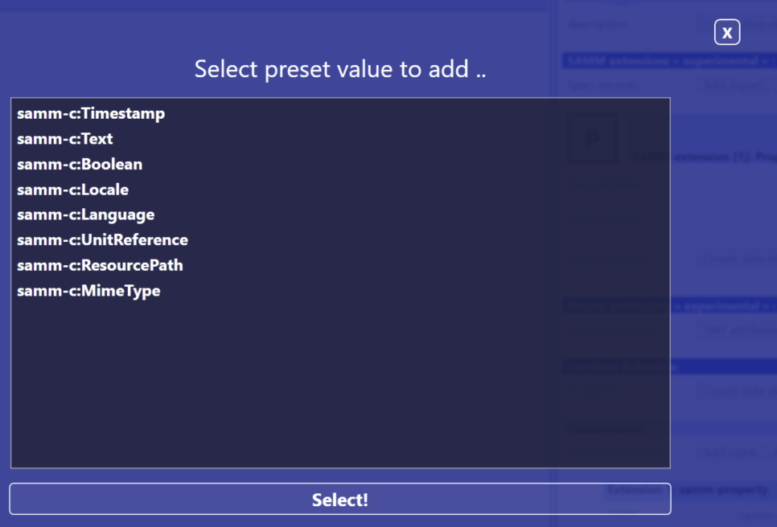

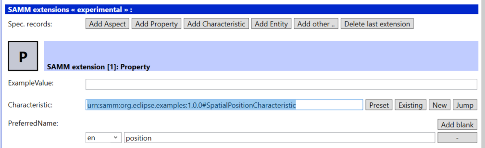


We start Step 1) to Step 7) but this time choose the SAMM element type "Property". This Concept Description shall contain the information for the SAMM-property "position". As the characteristic we add  the newly defined characteristic "urn:samm:org.eclipse.examples:1.0.0#SpatialPositionCharacteristic". This is why we need to add a new Concept Description representing the new characteristic "SpatialPositionCharacteristic" (following the steps 1) to Step 7)). As a SAMM model element type we choose "SingleEntity". As a data type we add "urn:samm:org.eclipse.examples:1.0.0#SpatialPosition".

For the SAMM-property "position" we create a new Concept Description of SAMM model element type "Entity" with ID "urn:samm:org.eclipse.examples:1.0.0#SpatialPosition", that is used as data type in the characteristic "SpatialPositionCharacteristic".

An important characteristic are the characteristic for sets, lists etc. For those the unique ID of the Element Characteristic needs to be added. A predefined characteristic may be used, see Step 10).

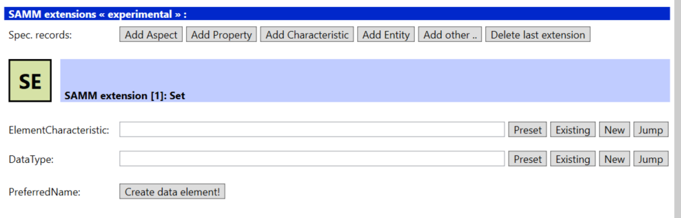

Traits are also supported. A Trait is a combination of a characteristic and a constraint. In this case an existing BaseCharacteristic and several constraints can be added. 


For each Constraint again a separate Concept Description of SAMM model element type "Constraint" needs to be created following steps 1) to 7). Choose one of the predefined constraint types like "RangeConstraint" etc.

**Step 11) (Context: Trait) Edit "BaseCharacteristic" and add IDs of cosntraints ("Constraint" and "+").**

### Export Aspect Model

For exporting an aspect model from a choosen concept description use the "File/Export .../Export SAMM aspect model by selected CD". Before calling the export function you must select an concept description of type "samm-aspect".

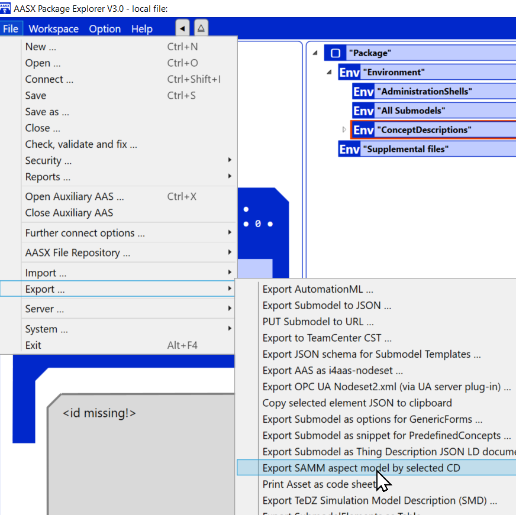

# Background on Implementation

## Data Specifications and Extensions


The [Specification of the Asset Administration Shell](https://industrialdigitaltwin.org/en/content-hub/aasspecifications) support embedded data specifications. Data Specifications are supporting standardized extension points whereas Extensions are used for proprietary extensions (class "HasExtensions" in Part 1). All referables are allowed to have proprietary extensions.

Especially for concept descriptions it was foreseen that there will be different kinds of concept descriptions that need to be supported. In a first step a data specification for IEC61360 properties and values was standardized (Part 3a). These data specifications are embedded, i.e. they are part of the standardized schemas in https://github.com/admin-shell-io/aas-specs.

## SAMM Extensions

Since there is no standardized data specification for aspect models conformant to SAMM so far the extension mechanism was used to implement the functionality as explained in this document.

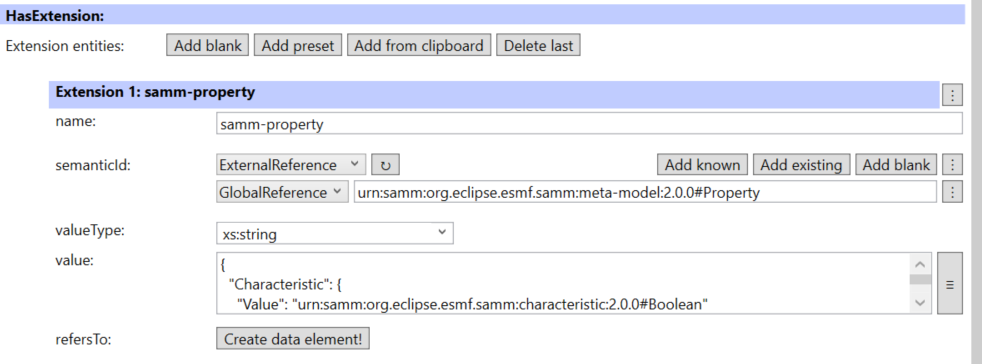

The semanticId of each extension corresponds to the SAMM Metamodel ID. For example the extension of a Concept Description representing a SAMM-property has the semantic ID *urn:samm:org.eclipse.esmf.samm:meta-model:2.0.0#Property*. The value of the Extension carries the attributes as well as the values of the attributes in a JSON format. This is why the "valueType" is "xs:string". In this example the attributes specific for a SAMM property are "Characteristic" and "PreferredName". 

    
    <extension>

      <semanticId>
        <type>ExternalReference</type>
        <keys>
          <key>
            <type>GlobalReference</type>
            <value>urn:samm:org.eclipse.esmf.samm:meta-model:2.0.0#Property</value>
          </key>
        </keys>
      </semanticId> 

      <name>samm-property</name>

      <valueType>xs:string</valueType>

      <value>{
        "Characteristic": {
          "Value": "urn:samm:org.eclipse.esmf.samm:characteristic:2.0.0#Boolean"
        },
        "PreferredName": [
        {
         "Language": "en",
         "Text": "is moving"
        }
       ]
      }</value>

    </extension>


The JSON value for an extension for a SAMM Measurement would look like this. It contains additionally a Unit ID.

      <value>{
        "Unit": {
          "Value": "urn:samm:org.eclipse.esmf.samm:unit:2.0.0#kilometrePerHour"
        },
       "DataType": {
          "Value": "http://www.w3.org/2001/XMLSchema#float"
       },
      "PreferredName": [
       {
         "Language": "en",
        "Text": "speed"
       }
      ]
    }</value>


