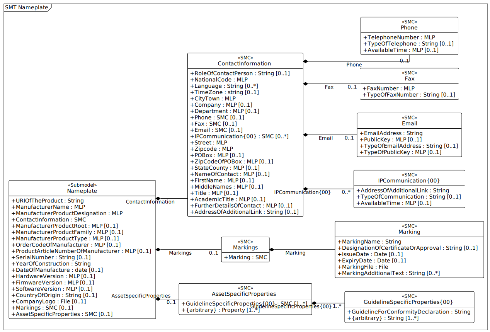

# IDTA 02006-2-0 Digital Nameplate for Industrial Equipment

This is a Submodel Template of the Asset Adminstration Shell

20th October 2022

Specification

# Imprint 

Publisher
```
Industrial Digital Twin Association
Lyoner Strasse 18
60528 Frankfurt am Main
Germany
https://www.industrialdigitaltwin.org/
```
# Note

This is a sample text. Neither the structure, text nor figures are normative in any sense. 
Large fractions of the text/ figures were omitted for the sake of clarity/ shortness.

# 1 General
## 1.1 About this document

This document is a part of a specification series. Each part specifies the contents of a Submodel template for the Asset Administration Shell (AAS). The AAS is described in [1], [2], [3] and [6]. First exemplary Submodel contents were described in [4], while the actual format of this document was derived by the "Administration Shell in Practice" [5]. The format aims to be very concise, giving only minimal necessary information for applying a Submodel template, while leaving deeper descriptions and specification of concepts, structures and mapping to the respective documents [1] to [6].
The target group of the specification are developers and editors of technical documentation and manufacturer information, which are describing assets in smart manufacturing by means of the Asset Administration Shell (AAS) and therefore need to create a Submodel instance with a hierarchy of SubmodelElements. This document especially details on the question, which SubmodelElements with which semantic identification shall be used for this purpose.

## 1.2 Scope of the Submodel

This Submodel template aims to provide asset nameplate information to the respective Asset Administration Shells in an interoperable manner. Central element is the provision of properties [7], ideally interoperable by the means of dictionaries such as ECLASS and IEC CDD (Common Data Dictionary). While in the current version an IRI is provided for a small quantity of the specified properties as their semantic identifier, a complete harmonization of all properties is planned for the subsequent version 2.1. The purpose of this document is to make selected specifications of Submodels in such manner that information about assets and their nameplate can be exchanged in a meaningful way between partners in a value creation network. It targets equipment for process industry and factory automation by defining standardized meta data. 
The intended use case is the provision of a standardized property structure within a digital nameplate, which enables the interoperability of digital nameplates from different manufacturers.
This concept can serve as a basis for standardizing the respective Submodel. The conception is based on existing norms, directives and standards so that a far-reaching acceptance can be achieved. 
Beside standardized Submodel this template also introduces standardized SubmodelElementCollections (SMC) in order to improve the interoperability while modelling partial aspects within Submodels. The standardized SMCs include address and asset product marking.

## 1.3 Relevant standards for the Submodel template

The current version of the Submodel template is considered to meet the minimum requirement for nameplate information, hence it concentrates on the requirements specified by EU directives according to the Blue Guide published in the Official Journal of the EU-Commission. Furthermore, the current version provides a concept for modelling nameplate information required in the field of explosion protection according to the Directive 2014/34/EU. 
The EU directive 2006/42/EC aims to standardize the market entry requirements for machines in the European economic area and further related countries. In regard to nameplate the EU directive establishes the minimum requirements on information a nameplate should provide which state as follows:

* the business name and full address of the manufacturer and, where applicable, his authorised representative,
* designation of the machinery,
* the CE Marking,
* designation of series or type,
* serial number, if any,
* the year of construction, that is the year in which the manufacturing process is completed.

With regard to explosion-protected equipment, various additional information is required for the respective device to be contained in the nameplate [8]. The additional information set also strongly depends on the country, e.g.

* Directive 2014/34/EU: specific mark of explosion protection, Equipment Group, Category, Gas or Dust areas etc.
* IEC Ex: Type of Protection, Equipment Protection Level, certificate number, etc.
* North America: Class, Division, Groups, Type of Protection, etc.

According to [3], interoperable properties might be defined by standards, consortium specifcations or manufacturer specifications. Useful standards providing sources of concepts are:
Table 1 List of examplary standards defining interoperable properties
IEC 62890:2020-07 " Industrial-process measurement, control and automation - Life-cycle-management for systems and components
Describes basic concepts of product types and instances and the concepts of a life-cycle mode
VDMA 24903 " Obsolescence management " Exchange of information regarding change and discontinuance of products and items
Describes important event in the life-cycle of a product type and identifies important information elements to be conveyed

So called property dictionaries are used identify information elements (see Terms and Definitions of [6]). Such property dictionaries include:

* ECLASS, see: https://www.eclasscontent.com/
* IEC CDD, see: https://cdd.iec.ch/cdd/iec61987/iec61987.nsf and https://cdd.iec.ch/cdd/iec62683/cdddev.nsf

In this document, properties are aimed to be described by ECLASS.
Further relevant basic requirements for nameplates are described in [8] and [9].
Requirements specified by further regulations and directives will be taken into account in subsequent versions.

## 1.4 Explanations on used UML diagrams

For clarity and an improved legibility readers suggested to go through this section at first before reading the following chapters.

Further details about UML diagrams please refer to [6] and [10].
Further details about used table formats please refer to Annex A.

# 2 Information set for Submodel "Nameplate"

# 2.1 General

The Submodel template was motivated by the prior ZVEI project "Digital Nameplate". While defining Submodels the following three aspects must be considered as suggested in [5]:
Use and economic relevance

A nameplate contains identifying, descriptive and indicating information about an asset. Given the variety of requirements from national and global institutions, conventional nameplate have reached their limits of presenting mandatory content. Especially for industrial equipment in explosion hazardous areas the amount of information required on the markings has increased even more. The Submodel "Nameplate" helps to standardize the information structure for modelling a nameplate in compliance with EU Machine Directive 2006/42/EC. As a result, a breakthrough of restrictions due to limited labeling field can be achieved. At the same time the availability of asset information is widened from local to global level enabling further partners along the value chain to have access to nameplate information. The machine readability can be realized without ambiguity with the help of semantic information.
Possible functions and interactions

The Submodel "Nameplate" provides information from a nameplate. Customers or potential customers can use this Submodel to acquire identifying, classifying information about an asset, such as the manufacturer name, model type or serial number and the provided product markings. Customers can also use this Submodel to verify the asset with their order. Beside the customers public authorities and inter-trade organizations may also share interest in this Submodel in order to examine the information integrity stipulated for a nameplate. Manufacturers use this Submodel to fulfill the legal commitment on the one hand, on the other hand this Submodel helps them to identify the right asset in case maintenance services or spare parts are needed.
By using the SMC "Marking" and its child element SMC "ExplosionSafety" mandatory nameplate content related to explosion protection can be modelled sufficiently. The modelling method was concepted in such manner that a wide range of national and international regulations and standards regarding explosion protection were taken into account.
In order to take regulations for nameplate from further standards or directives into account additional properties can be modelled with SMC "AssetSpecificProperties" and its child element SMC "GuidelineSpecificProperties" while reference to the additional standard document should be stored in the property "GuidelineForConformityDeclaration". A separate SMC "GuidelineSpecificProperties" needs to be created for each additional standard and all SMC "GuidelineSpecificProperties" should be placed under the parent node "AssetSpecificProperties".
Property specification

See clause 3 "Submodel and collections".

# 2.2 UML

The following UML diagram holds true.



# 3 Heading

## 3.1 Nameplate


| idShort:| Nameplate| | |
| :--- | :--- | :--- | :--- |
| Class:| Submodel| | |
| semanticId:| [IRI] https://admin-shell.io/zvei/nameplate/2/0/Nameplate| | |
| Parent:| Nameplate| | |
| Explanation:| Contains the nameplate information attached to the product@en| | |

| [SME type]<br/>idShort| semanticId = [idType]value<br/>Description@en| [valueType]<br/>example| card.|
| :--- | :--- | :--- | :--- |
| [Property]<br/>URIOfTheProduct| [IRDI]0173-1#02-AAY811#001<br/> unique global identification of the product using an universal resource identifier (URI) Note: see also [IRDI] 0112/2///61987#ABN590#001 URI of product instance | [String]<br/>https://www.domain-abc.com/Model-Nr-1234/Serial-Nr-5678| 1|
| [MLP]<br/>ManufacturerName| [IRDI]0173-1#02-AAO677#002<br/> legally valid designation of the natural or judicial person which is directly responsible for the design, production, packaging and labeling of a product in respect to its being brought into circulation Note: see also [IRDI] 0112/2///61987#ABA565#007 manufacturer Note: mandatory property according to EU Machine Directive 2006/42/EC. | []<br/>Muster AG@de| 1|
| [MLP]<br/>ManufacturerProductDesignation| [IRDI]0173-1#02-AAW338#001<br/> Short description of the product (short text)  Note: see also [IRDI] 0112/2///61987#ABA567#007 name of product Note: Short designation of the product is meant. Note: mandatory property according to EU Machine Directive 2006/42/EC. | []<br/>ABC-123@en| 1|
| [SMC]<br/>ContactInformation| [IRI]https://admin-shell.io/zvei/nameplate/1/0/ContactInformations/ContactInformation<br/> The SMC “ContactInformation” contains information on how to contact the manufacturer or an authorised service provider, e.g. when a maintenance service is required The SMC “ContactInformation” contains information on how to contact the manufacturer or an authorised service provider, e.g. when a maintenance service is required. Note: physical address is a mandatory property according to EU Machine Directive 2006/42/EC| []<br/>23 elements| 1|
| [MLP]<br/>ManufacturerProductRoot| [IRDI]0173-1#02-AAU732#001<br/> Top level of a 3 level manufacturer specific product hierarchy | []<br/>flow meter@en| 0..1|
| [MLP]<br/>ManufacturerProductFamily| [IRDI]0173-1#02-AAU731#001<br/> 2nd level of a 3 level manufacturer specific product hierarchy Note: conditionally mandatory property according to EU Machine Directive 2006/42/EC. One of the two properties must be provided: ManufacturerProductFamily (0173-1#02-AAU731#001) or ManufacturerProductType (0173-1#02-AAO057#002). | []<br/>Type ABC@en| 0..1|
| [MLP]<br/>ManufacturerProductType| [IRDI]0173-1#02-AAO057#002<br/> Characteristic to differentiate between different products of a product family or special variants Note: see also [IRDI] 0112/2///61987#ABA300#006 code of product Note: conditionally mandatory property according to EU Machine Directive 2006/42/EC. One of the two properties must be provided: ManufacturerProductFamily (0173-1#02-AAU731#001) or ManufacturerProductType (0173-1#02-AAO057#002). | []<br/>FM-ABC-1234@en| 0..1|
| [MLP]<br/>OrderCodeOfManufacturer| [IRDI]0173-1#02-AAO227#002<br/> By manufactures issued unique combination of numbers and letters used to identify the device for ordering Note: see also [IRDI] 0112/2///61987#ABA950#006 order code of product Note: Recommendation: property declaration as MLP is required by its semantic definition. As the property value is language independent, users are recommended to provide maximal 1 string in any language of the user’s choice.| []<br/>FMABC1234@en| 0..1|
| [MLP]<br/>ProductArticleNumberOfManufacturer| [IRDI]0173-1#02-AAO676#003<br/> unique product identifier of the manufacturer Note: see also [IRDI] 0112/2///61987#ABA581#006 article number Note: Recommendation: property declaration as MLP is required by its semantic definition. As the property value is language independent, users are recommended to provide maximal 1 string in any language of the user’s choice.| []<br/>FM11-ABC22-123456@en| 0..1|
| [Property]<br/>SerialNumber| [IRDI]0173-1#02-AAM556#002<br/> unique combination of numbers and letters used to identify the device once it has been manufactured Note: see also [IRDI] 0112/2///61987#ABA951#007 serial number | [String]<br/>12345678| 0..1|
| [Property]<br/>YearOfConstruction| [IRDI]0173-1#02-AAP906#001<br/> Year as completion date of object Note: mandatory property according to EU Machine Directive 2006/42/EC. | [String]<br/>2022| 1|
| [Property]<br/>DateOfManufacture| [IRDI]0173-1#02-AAR972#002<br/> Date from which the production and / or development process is completed or from which a service is provided completely Note: see also [IRDI] 0112/2///61987#ABB757#007 date of manufacture Note: format by lexical representation: CCYY-MM-DD | [date]<br/>2022-01-01| 0..1|
| [MLP]<br/>HardwareVersion| [IRDI]0173-1#02-AAN270#002<br/> Version of the hardware supplied with the device Note: see also [IRDI] 0112/2///61987#ABA926#006 hardware version Note: Recommendation: property declaration as MLP is required by its semantic definition. As the property value is language independent, users are recommended to provide maximal 1 string in any language of the user’s choice.| []<br/>1.0.0@en| 0..1|
| [MLP]<br/>FirmwareVersion| [IRDI]0173-1#02-AAM985#002<br/> Version of the firmware supplied with the device Note: see also [IRDI] 0112/2///61987#ABA302#004 firmware version Note: Recommendation: property declaration as MLP is required by its semantic definition. As the property value is language independent, users are recommended to provide maximal 1 string in any language of the user’s choice.| []<br/>1.0@en| 0..1|
| [MLP]<br/>SoftwareVersion| [IRDI]0173-1#02-AAM737#002<br/> Version of the software used by the device Note: see also [IRDI] 0112/2///61987#ABA601#006 software version Note: Recommendation: property declaration as MLP is required by its semantic definition. As the property value is language independent, users are recommended to provide maximal 1 string in any language of the user’s choice.| []<br/>1.0.0@en| 0..1|
| [Property]<br/>CountryOfOrigin| [IRDI]0173-1#02-AAO259#004<br/> Country where the product was manufactured Note: see also [IRDI] 0112/2///61360_4#ADA034#001 country of origin Note: Country codes defined accord. to DIN EN ISO 3166-1 alpha-2 codes | [String]<br/>DE| 0..1|
| [File]<br/>CompanyLogo| [IRI]https://admin-shell.io/zvei/nameplate/2/0/Nameplate/CompanyLogo <br/> A graphic mark used to represent a company, an organisation or a product | []<br/>| 0..1|
| [SMC]<br/>Markings| [IRDI]0173-1#01-AGZ673#001<br/> Collection of product markings Note: CE marking is declared as mandatory according to EU Machine Directive 2006/42/EC.| []<br/>1 elements| 0..1|
| [SMC]<br/>AssetSpecificProperties| [IRDI]0173-1#01-AGZ672#001<br/> Group of properties that are listed on the asset's nameplate and are grouped based on guidelines Note: defined as “Asset specific nameplate information” per ECLASS | []<br/>2 elements| 0..1|


## 3.2 ContactInformation


| idShort:| ContactInformation| | |
| :--- | :--- | :--- | :--- |
| Class:| SubmodelElementCollection| | |
| semanticId:| [IRI] https://admin-shell.io/zvei/nameplate/1/0/ContactInformations/ContactInformation| | |
| Parent:| ContactInformation| | |
| Explanation:| The SMC “ContactInformation” contains information on how to contact the manufacturer or an authorised service provider, e.g. when a maintenance service is required. Note: physical address is a mandatory property according to EU Machine Directive 2006/42/EC@en| | |

| [SME type]<br/>idShort| semanticId = [idType]value<br/>Description@en| [valueType]<br/>example| card.|
| :--- | :--- | :--- | :--- |
| [Property]<br/>RoleOfContactPerson| [IRDI]0173-1#02-AAO204#003<br/> function of a contact person in a process enumeration: 0173-1#07-AAS927#001 (administrativ contact), 0173-1#07-AAS928#001 (commercial contact), 0173-1#07-AAS929#001 (other contact), 0173-1#07-AAS930#001 (hazardous goods contact), 0173-1#07-AAS931#001 (technical contact). Note: the above mentioned ECLASS enumeration should be declared as “open” for further addition. ECLASS enumeration IRDI is preferable. If no IRDI available, custom input as String may also be accepted.| [String]<br/>0173-1#07-AAS931#001| 0..1|
| [MLP]<br/>NationalCode| [IRDI]0173-1#02-AAO134#002<br/> code of a country Note: see also [IRDI] 0112/2///61360_4#ADA005#001 country code. country codes defined accord. to DIN EN ISO 3166-1 alpha-2 codes. Mandatory property according to EU Machine Directive 2006/42/EC. Recommendation: property declaration as MLP is required by its semantic definition. As the property value is language independent, users are recommended to provide maximal 1 string in any language of the user’s choice.| []<br/>DE@en| 1|
| [Property]<br/>Language| [IRI]https://admin-shell.io/zvei/nameplate/1/0/ContactInformations/ContactInformation/Language<br/> Available language Note: language codes defined accord. to ISO 639-1. Note: as per ECLASS definition, Expression and representation of thoughts, information, feelings, ideas through characters.| [String]<br/>de| 0..*|
| [Property]<br/>TimeZone| [IRI]https://admin-shell.io/zvei/nameplate/1/0/ContactInformations/ContactInformation/TimeZone<br/> offsets from Coordinated Universal Time (UTC) Note: notation accord. to ISO 8601 Note: for time in UTC the zone designator “Z” is to be used| [string]<br/>Z| 0..1|
| [MLP]<br/>CityTown| [IRDI]0173-1#02-AAO132#002<br/> town or city Note: see also [IRDI] 0112/2///61987#ABA129#001 city/town. Mandatory property according to EU Machine Directive 2006/42/EC.| []<br/>Musterstadt@de| 1|
| [MLP]<br/>Company| [IRDI]0173-1#02-AAW001#001<br/> name of the company | []<br/>ABC Company@en| 0..1|
| [MLP]<br/>Department| [IRDI]0173-1#02-AAO127#003<br/> administrative section within an organisation where a business partner is located | []<br/>Vertrieb@de| 0..1|
| [SMC]<br/>Phone| [IRI]https://admin-shell.io/zvei/nameplate/1/0/ContactInformations/ContactInformation/Phone<br/> Phone number including type | []<br/>3 elements| 0..1|
| [SMC]<br/>Fax| [IRDI]0173-1#02-AAQ834#005<br/> Fax number including type | []<br/>2 elements| 0..1|
| [SMC]<br/>Email| [IRDI]0173-1#02-AAQ836#005<br/> E-mail address and encryption method | []<br/>4 elements| 0..1|
| [SMC]<br/>IPCommunication{00}| [IRI]https://admin-shell.io/zvei/nameplate/1/0/ContactInformations/<br/> ContactInformation/IPCommunication IP-based communication channels, e.g. chat or video call | []<br/>3 elements| 0..*|
| [MLP]<br/>Street| [IRDI]0173-1#02-AAO128#002<br/> street name and house number Note: see also [IRDI] 0112/2///61987#ABA286#001 street. Mandatory property according to EU Machine Directive 2006/42/EC| []<br/>Musterstraße 1@de| 1|
| [MLP]<br/>Zipcode| [IRDI]0173-1#02-AAO129#002<br/> ZIP code of address Note: see also [IRDI] 0112/2///61987#ABA281#001 ZIP/Postal code. Mandatory property according to EU Machine Directive 2006/42/EC. Recommendation: property declaration as MLP is required by its semantic definition. As the property value is language independent, users are recommended to provide maximal 1 string in any language of the user’s choice.| []<br/>12345@de| 1|
| [MLP]<br/>POBox| [IRDI]0173-1#02-AAO130#002<br/> P.O. box number | []<br/>PF 1234@en| 0..1|
| [MLP]<br/>ZipCodeOfPOBox| [IRDI]0173-1#02-AAO131#002<br/> ZIP code of P.O. box address Recommendation: property declaration as MLP is required by its semantic definition. As the property value is language independent, users are recommended to provide maximal 1 string in any language of the user’s choice.| []<br/>12345@en| 0..1|
| [MLP]<br/>StateCounty| [IRDI]0173-1#02-AAO133#002<br/> federal state a part of a state | []<br/>Muster-Bundesland@de| 0..1|
| [MLP]<br/>NameOfContact| [IRDI]0173-1#02-AAO205#002<br/> surname of a contact person | []<br/>| 0..1|
| [MLP]<br/>FirstName| [IRDI]0173-1#02-AAO206#002<br/> first name of a contact person | []<br/>| 0..1|
| [MLP]<br/>MiddleNames| [IRDI]0173-1#02-AAO207#002<br/> middle names of contact person | []<br/>| 0..1|
| [MLP]<br/>Title| [IRDI]0173-1#02-AAO208#003<br/> common, formal, religious, or other title preceding a contact person's name | []<br/>| 0..1|
| [MLP]<br/>AcademicTitle| [IRDI]0173-1#02-AAO209#003<br/> academic title preceding a contact person's name | []<br/>| 0..1|
| [MLP]<br/>FurtherDetailsOfContact| [IRDI]0173-1#02-AAO210#002<br/> additional information of the contact person | []<br/>| 0..1|
| [Property]<br/>AddressOfAdditionalLink| [IRDI]0173-1#02-AAQ326#002<br/> web site address where information about the product or contact is given | [String]<br/>| 0..1|


## 3.3 Phone


| idShort:| Phone| | |
| :--- | :--- | :--- | :--- |
| Class:| SubmodelElementCollection| | |
| semanticId:| [IRI] https://admin-shell.io/zvei/nameplate/1/0/ContactInformations/ContactInformation/Phone| | |
| Parent:| Phone| | |
| Explanation:| | | |

| [SME type]<br/>idShort| semanticId = [idType]value<br/>Description@en| [valueType]<br/>example| card.|
| :--- | :--- | :--- | :--- |
| [MLP]<br/>TelephoneNumber| [IRDI]0173-1#02-AAO136#002<br/> complete telephone number to be called to reach a business partner Recommendation: property declaration as MLP is required by its semantic definition. As the property value is language independent, users are recommended to provide maximal 1 string in any language of the user’s choice.| []<br/>+491234567890@en| 1|
| [Property]<br/>TypeOfTelephone| [IRDI]0173-1#02-AAO137#003<br/> characterization of a telephone according to its location or usage  enumeration: 0173-1#07-AAS754#001 (office), 0173-1#07-AAS755#001 (office mobile), 0173-1#07-AAS756#001 (secretary), 0173-1#07-AAS757#001 (substitute), 0173-1#07-AAS758#001 (home), 0173-1#07-AAS759#001 (private mobile)| [String]<br/>0173-1#07-AAS754#001| 0..1|
| [MLP]<br/>AvailableTime| [IRI]https://admin-shell.io/zvei/nameplate/1/0/ContactInformations/ContactInformation/AvailableTime/<br/> Specification of the available time window | []<br/>Montag – Freitag 08:00 bis 16:00@de| 0..1|


## 3.4 Fax


| idShort:| Fax| | |
| :--- | :--- | :--- | :--- |
| Class:| SubmodelElementCollection| | |
| semanticId:| [IRDI] 0173-1#02-AAQ834#005| | |
| Parent:| Fax| | |
| Explanation:| | | |

| [SME type]<br/>idShort| semanticId = [idType]value<br/>Description@en| [valueType]<br/>example| card.|
| :--- | :--- | :--- | :--- |
| [MLP]<br/>FaxNumber| [IRDI]0173-1#02-AAO195#002<br/> complete telephone number to be called to reach a business partner's fax machine Recommendation: property declaration as MLP is required by its semantic definition. As the property value is language independent, users are recommended to provide maximal 1 string in any language of the user’s choice.| []<br/>+491234567890@en| 1|
| [Property]<br/>TypeOfFaxNumber| [IRDI]0173-1#02-AAO196#003<br/> characterization of the fax according its location or usage enumeration: 0173-1#07-AAS754#001 (office), 0173-1#07-AAS756#001 (secretary), 0173-1#07-AAS758#001 (home)| [String]<br/> 0173-1#07-AAS754#001| 0..1|


## 3.5 Email


| idShort:| Email| | |
| :--- | :--- | :--- | :--- |
| Class:| SubmodelElementCollection| | |
| semanticId:| [IRDI] 0173-1#02-AAQ836#005| | |
| Parent:| Email| | |
| Explanation:| | | |

| [SME type]<br/>idShort| semanticId = [idType]value<br/>Description@en| [valueType]<br/>example| card.|
| :--- | :--- | :--- | :--- |
| [Property]<br/>EmailAddress| [IRDI]0173-1#02-AAO198#002<br/> electronic mail address of a business partner | [String]<br/>email@muster-ag.de| 1|
| [MLP]<br/>PublicKey| [IRDI]0173-1#02-AAO200#002<br/> public part of an unsymmetrical key pair to sign or encrypt text or messages Recommendation: property declaration as MLP is required by its semantic definition. As the property value is language independent, users are recommended to provide maximal 1 string in any language of the user’s choice.| []<br/>| 0..1|
| [Property]<br/>TypeOfEmailAddress| [IRDI]0173-1#02-AAO199#003<br/> characterization of an e-mail address according to its location or usage enumeration: 0173-1#07-AAS754#001 (office), 0173-1#07-AAS756#001 (secretary), 0173-1#07-AAS757#001 (substitute), 0173-1#07-AAS758#001 (home)| [String]<br/>0173-1#07-AAS754#001| 0..1|
| [MLP]<br/>TypeOfPublicKey| [IRDI]0173-1#02-AAO201#002<br/> characterization of a public key according to its encryption process | []<br/>| 0..1|


## 3.6 IPCommunication{00}


| idShort:| IPCommunication{00}| | |
| :--- | :--- | :--- | :--- |
| Class:| SubmodelElementCollection| | |
| semanticId:| [IRI] https://admin-shell.io/zvei/nameplate/1/0/ContactInformations/| | |
| Parent:| IPCommunication{00}| | |
| Explanation:| | | |

| [SME type]<br/>idShort| semanticId = [idType]value<br/>Description@en| [valueType]<br/>example| card.|
| :--- | :--- | :--- | :--- |
| [Property]<br/>AddressOfAdditionalLink| [IRDI]0173-1#02-AAQ326#002<br/> web site address where information about the product or contact is given | [String]<br/>| 1|
| [Property]<br/>TypeOfCommunication| [IRI]https://admin-shell.io/zvei/nameplate/1/0/ ContactInformations/ContactInformation/IPCommunication/TypeOfCommunication<br/> characterization of an IP-based communication channel | [String]<br/>Chat| 0..1|
| [MLP]<br/>AvailableTime| [IRI]https://admin-shell.io/zvei/nameplate/1/0/ContactInformations/ContactInformation/AvailableTime/<br/> Specification of the available time window | []<br/>Montag – Freitag 08:00 bis 16:00@de| 0..1|


## 3.7 Markings


| idShort:| Markings| | |
| :--- | :--- | :--- | :--- |
| Class:| SubmodelElementCollection| | |
| semanticId:| [IRDI] 0173-1#01-AGZ673#001| | |
| Parent:| Markings| | |
| Explanation:| Note: CE marking is declared as mandatory according to EU Machine Directive 2006/42/EC.@en| | |

| [SME type]<br/>idShort| semanticId = [idType]value<br/>Description@en| [valueType]<br/>example| card.|
| :--- | :--- | :--- | :--- |
| [SMC]<br/>Marking| [IRDI]0173-1#01-AHD206#001<br/>  Note: see also [IRDI] 0112/2///61987#ABH515#003 Certificate or approval Note: CE marking is declared as mandatory according to the Blue Guide of the EU-Commission | []<br/>7 elements| |


## 3.8 Marking


| idShort:| Marking| | |
| :--- | :--- | :--- | :--- |
| Class:| SubmodelElementCollection| | |
| semanticId:| [IRDI] 0173-1#01-AHD206#001| | |
| Parent:| Marking| | |
| Explanation:| Note: see also [IRDI] 0112/2///61987#ABH515#003 Certificate or approval Note: CE marking is declared as mandatory according to the Blue Guide of the EU-Commission @en| | |

| [SME type]<br/>idShort| semanticId = [idType]value<br/>Description@en| [valueType]<br/>example| card.|
| :--- | :--- | :--- | :--- |
| [Property]<br/>MarkingName| [IRI]https://admin-shell.io/zvei/nameplate/2/0/Nameplate/Markings/Marking/MarkingName<br/> common name of the marking Note: see also [IRDI] 0173-1#02-BAB392#015 certificate/approval valueId with ECLASS enumeration IRDI is preferable, e.g. [IRDI] 0173-1#07-DAA603#004 for CE. If no IRDI available, string value can also be accepted. Note: CE marking is declared as mandatory according to Blue Guide of the EU-Commission | [String]<br/>0173-1#07-DAA603#004| 1|
| [Property]<br/>DesignationOfCertificateOrApproval| [IRDI]0112/2///61987#ABH783#001<br/> alphanumeric character sequence identifying a certificate or approval Note: Approval identifier, reference to the certificate number, to be entered without spaces | [String]<br/>KEMA99IECEX1105/128| 0..1|
| [Property]<br/>IssueDate| [IRI]https://admin-shell.io/zvei/nameplate/2/0/Nameplate/Markings/Marking/IssueDate<br/> Date, at which the specified certificate is issued  Note: format by lexical representation: CCYY-MM-DD Note: to be specified to the day | [Date]<br/>2022-01-01| 0..1|
| [Property]<br/>ExpiryDate| [IRI]https://admin-shell.io/zvei/nameplate/2/0/Nameplate/Markings/Marking/ExpiryDate<br/> Date, at which the specified certificate expires  Note: see also ([IRDI] 0173-1#02-AAO997#001 Validity date Note: format by lexical representation: CCYY-MM-DD Note: to be specified to the day | [Date]<br/>2022-01-01| 0..1|
| [File]<br/>MarkingFile| [IRI]https://admin-shell.io/zvei/nameplate/2/0/Nameplate/Markings/Marking/MarkingFile<br/> conformity symbol of the marking  | []<br/>/aasx/Nameplate/marking_ce.png | 1|
| [Property]<br/>MarkingAdditionalText| [IRI]https://admin-shell.io/zvei/nameplate/2/0/Nameplate/Markings/Marking/MarkingAdditionalText<br/> where applicable, additional information on the marking in plain text, e.g. the ID-number of the notified body involved in the conformity process Note: see also [IRDI] 0173-1#02-AAM954#002 details of other certificate | [String]<br/>0044| 0..*|
| [SMC]<br/>ExplosionSafeties| [IRI]https://admin-shell.io/zvei/nameplate/2/0/Nameplate/Markings/Marking/ExplosionSafeties<br/> Collection of explosion safety specifications | []<br/>1 elements| 0..1|


## 3.9 ExplosionSafeties


| idShort:| ExplosionSafeties| | |
| :--- | :--- | :--- | :--- |
| Class:| SubmodelElementCollection| | |
| semanticId:| [IRI] https://admin-shell.io/zvei/nameplate/2/0/Nameplate/Markings/Marking/ExplosionSafeties| | |
| Parent:| ExplosionSafeties| | |
| Explanation:| | | |

| [SME type]<br/>idShort| semanticId = [idType]value<br/>Description@en| [valueType]<br/>example| card.|
| :--- | :--- | :--- | :--- |
| [SMC]<br/>ExplosionSafety| [IRI]https://admin-shell.io/zvei/nameplate/2/0/Nameplate/Markings/Marking/ExplosionSafeties/ExplosionSafety<br/> contains information related to explosion safety according to device nameplate | []<br/>11 elements| 1..*|


## 3.10 ExplosionSafety


| idShort:| ExplosionSafety| | |
| :--- | :--- | :--- | :--- |
| Class:| SubmodelElementCollection| | |
| semanticId:| [IRI] https://admin-shell.io/zvei/nameplate/2/0/Nameplate/Markings/Marking/ExplosionSafeties/ExplosionSafety| | |
| Parent:| ExplosionSafety| | |
| Explanation:| | | |

| [SME type]<br/>idShort| semanticId = [idType]value<br/>Description@en| [valueType]<br/>example| card.|
| :--- | :--- | :--- | :--- |
| [Property]<br/>DesignationOfCertificateOrApproval| [IRDI]0112/2///61987#ABH783#001<br/> alphanumeric character sequence identifying a certificate or approval Note: Approval identifier, reference to the certificate number, to be entered without spaces | [String]<br/>KEMA99IECEX1105/128| 0..1|
| [MLP]<br/>TypeOfApproval| [IRDI]0173-1#02-AAM812#003<br/> classification according to the standard or directive to which the approval applies Note: see also [IRDI] 0112/2///61987#ABA231#008 type of hazardous area approval Note: name of the approval system, e.g. ATEX, IECEX, NEC, EAC, CCC, CEC Note: only values from the enumeration should be used as stated. For additional systems further values can be used. Note: Recommendation: property declaration as MLP is required by its semantic definition. As the property value is language independent, users are recommended to provide maximal 1 string in any language of the user’s choice.| []<br/>ATEX@en| 0..1|
| [MLP]<br/>ApprovalAgencyTestingAgency| [IRDI]0173-1#02-AAM632#001<br/> certificates and approvals pertaining to general usage and compliance with constructional standards and directives Note: see also [IRDI] 0112/2///61987#ABA634#004 approval agency/testing agency Note: name of the agency, which has issued the certificate, e.g. PTB, KEMA, CSA, SIRA Note: only values from the enumeration should be used as stated. For additional systems further values can be used. Note: Recommendation: property declaration as MLP is required by its semantic definition. As the property value is language independent, users are recommended to provide maximal 1 string in any language of the user’s choice.| []<br/>PTB@en| 0..1|
| [Property]<br/>TypeOfProtection| [IRDI]0173-1#02-AAQ325#003<br/> classification of an explosion protection according to the specific measures applied to avoid ignition of a surrounding explosive atmosphere Note: see also [IRDI] 0112/2///61987#ABA589#002 type of protection (Ex) Note:  ·       Type of protection for the device as listed in the certificate ·       Symbol(s) for the Type of protection. Several types of protection are separated by a semicolon “;” ·       If several TypeOfProtection are listed in the same certificate, for each TypeOfProtection a separate SMC “Explosion Safety” shall be provided | [String]<br/>db| 0..1|
| [Property]<br/>RatedInsulationVoltage| [IRDI]0173-1#02-AAN532#003<br/> from the manufacturer for the capital assets limited isolation with given(indicated) operating conditions Note: Um(eff) Note: Insulation voltage, if specified in the certificate | [Decimal]<br/>250| 0..1|
| [Ref]<br/>InstructionsControlDrawing| [IRDI]0112/2///61987#ABO102#001<br/> designation used to uniquely identify a control/reference drawing stored in a file system Note: Reference to the instruction manual or control drawing | []<br/>| 0..1|
| [Property]<br/>SpecificConditionsForUse| [IRI]https://admin-shell.io/zvei/nameplate/2/0/Nameplate/Markings/Marking/ExplosionSafeties/ExplosionSafety/SpecificConditionsForUse<br/> Note: X if any, otherwise no entry Note: X if any, otherwise no entry| [string]<br/>X| 0..1|
| [Property]<br/>IncompleteDevice| [IRI]https://admin-shell.io/zvei/nameplate/2/0/Nameplate/Markings/Marking/ExplosionSafeties/ExplosionSafety/IncompleteDevice<br/> U if any, otherwise no entry | [string]<br/>U| 0..1|
| [SMC]<br/>AmbientConditions| [IRI]https://admin-shell.io/zvei/nameplate/2/0/Nameplate/Markings/Marking/ExplosionSafeties/ExplosionSafety/AmbientConditions<br/> Contains properties which are related to the ambient conditions of the device.  Note: If the device is mounted in the process boundary, ambient and process conditions are provided separately. | []<br/>9 elements| 0..1|
| [SMC]<br/>ProcessConditions| [IRI]https://admin-shell.io/zvei/nameplate/2/0/Nameplate/Markings/Marking/ExplosionSafeties/ExplosionSafety/ProcessConditions<br/> Contains properties which are related to the process conditions of the device.  Note: If the device is mounted in the process boundary, ambient and process conditions are provided separately. | []<br/>9 elements| 0..1|
| [SMC]<br/>ExternalElectricalCircuit| [IRI]https://admin-shell.io/zvei/nameplate/2/0/Nameplate/Markings/Marking/ExplosionSafeties/ExplosionSafety/ExternalElectricalCircuit<br/> specifies the parameters of external electrical circuits.  Note: If several external circuits can be connected to the device, this block shall provide a cardinality with the number of circuits Note: If for one external IS circuit several sets of safety parameters are provided (e.g. for several material groups), each set is specified in a separate block as a separate circuit. | []<br/>9 elements| 0..*|


## 3.11 AmbientConditions


| idShort:| AmbientConditions| | |
| :--- | :--- | :--- | :--- |
| Class:| SubmodelElementCollection| | |
| semanticId:| [IRI] https://admin-shell.io/zvei/nameplate/2/0/Nameplate/Markings/Marking/ExplosionSafeties/ExplosionSafety/AmbientConditions| | |
| Parent:| AmbientConditions| | |
| Explanation:| Note: If the device is mounted in the process boundary, ambient and process conditions are provided separately. @en| | |

| [SME type]<br/>idShort| semanticId = [idType]value<br/>Description@en| [valueType]<br/>example| card.|
| :--- | :--- | :--- | :--- |
| [Property]<br/>DeviceCategory| [IRDI]0173-1#02-AAK297#004<br/> category of device in accordance with directive 94/9/EC Note: see also [IRDI] 0112/2///61987#ABA467#002 equipment/device category Note: editorial definiton: Category of device in accordance with directive 2014/34/EU Note: Equipment category according to the ATEX system. According to the current nameplate, also the combination “GD” is permitted Note: The combination “GD” is no longer accepted and was changed in the standards. Currently the marking for “G” and “D” must be provided in a separate marking string. Older devices may still exist with the marking “GD”. | [String]<br/>2G| 0..1|
| [MLP]<br/>EquipmentProtectionLevel| [IRDI]0173-1#02-AAM668#001<br/> part of a hazardous area classification system indicating the likelihood of the existence of a classified hazard Note: see also [IRDI] 0112/2///61987#ABA464#005 equipment protection level Note: editorial definition: Level of protection assigned to equipment based on its likelihood of becoming a source of ignition Note: Equipment protection level according to the IEC standards. According to the current nameplate, also the combination “GD” is permitted Note: The combination “GD” is no longer accepted and was changed in the standards. Currently the marking for “G” and “D” must be provided in a separate marking string. Older devices may still exist with the marking “GD”. Note: Recommendation: property declaration as MLP is required by its semantic definition. As the property value is language independent, users are recommended to provide maximal 1 string in any language of the user’s choice.| []<br/>Gb@en| 0..1|
| [Property]<br/>RegionalSpecificMarking| [IRI]https://admin-shell.io/zvei/nameplate/2/0/Nameplate/Markings/Marking/ExplosionSafeties/ExplosionSafety/RegionalSpecificMarking<br/> Marking used only in specific regions, e.g. North America: class/divisions, EAC: “1” or NEC: “AIS” | [String]<br/>Class I, Division 2| 0..1|
| [Property]<br/>TypeOfProtection| [IRDI]0173-1#02-AAQ325#003<br/> classification of an explosion protection according to the specific measures applied to avoid ignition of a surrounding explosive atmosphere Note: see also [IRDI] 0112/2///61987#ABA589#002 type of protection (Ex) Note: Symbol(s) for the Type of protection. Several types of protection are separated by a semicolon “;” | [String]<br/>db| 0..1|
| [Property]<br/>ExplosionGroup| [IRDI]0173-1#02-AAT372#001<br/> classification of dangerous gaseous substances based on their ability to cause an explosion Note: see also [IRDI] 0112/2///61987#ABA961#007 permitted gas group/explosion group Note: Equipment grouping according to IEC 60079-0 is meant by this property Note: Symbol(s) for the gas group (IIA…IIC) or dust group (IIIA…IIIC) | [String]<br/>IIC| 0..1|
| [Property]<br/>MinimumAmbientTemperature| [IRDI]0173-1#02-AAZ952#001<br/> lower limit of the temperature range of the surrounding space in which the component, the pipework or the system can be operated Note: see also [IRDI] 0112/2///61987#ABA621#007 minimum ambient temperature Note: editorial defnition: lower limit of the temperature range of the environment in which the component, the pipework or the system can be operated Note: Rated minimum ambient temperature Note: Positive temperatures are listed without “+” sign. If several temperatures ranges are marked, only the most general range shall be indicated in the template, which is consistent with the specified temperature class or maximum surface temperature. Other temperature ranges and temperature classes/maximum surface temperatures may be listed in the instructions.| [Decimal]<br/>-40| 0..1|
| [Property]<br/>MaxAmbientTemperature| [IRDI]0173-1#02-BAA039#010<br/> upper limit of the temperature range of the surrounding space in which the component, the pipework or the system can be operated Note: see also [IRDI] 0112/2///61987#ABA623#007 maximum ambient temperature Note: editorial definition: upper limit of the temperature range of the environment in which the component, the pipework or the system can be operated Note: Rated maximum ambient temperature Note: Positive temperatures are listed without “+” sign. If several temperatures ranges are marked, only the most general range shall be indicated in the template, which is consistent with the specified temperature class or maximum surface temperature. Other temperature ranges and temperature classes/maximum surface temperatures may be listed in the instructions.| [Decimal]<br/>120| 0..1|
| [Property]<br/>MaxSurfaceTemperatureForDustProof| [IRDI]0173-1#02-AAM666#005<br/> maximum permissible surface temperature of a device used in an explosion hazardous area with combustible dust Note: see also [IRDI] 0112/2///61987#ABB159#004 maximum surface temperature for dust-proof Note: Maximum surface temperature of the device (dust layer ≤ 5 mm) for specified maximum ambient and maximum process temperature, relevant for Group III only Note: Positive temperatures are listed without “+” sign. If several temperatures ranges are marked, only the most general range shall be indicated in the template, which is consistent with the specified temperature class or maximum surface temperature. Other temperature ranges and temperature classes/maximum surface temperatures may be listed in the instructions.| [Decimal]<br/>100| 0..1|
| [Property]<br/>TemperatureClass| [IRDI]0173-1#02-AAO371#004<br/> classification system of electrical apparatus, based on its maximum surface temperature, related to the specific explosive atmosphere for which it is intended to be used Note: see also [IRDI] 0112/2///61987#ABA593#002 temperature class Note: editorial definition: classification system of electrical apparatus, based on its maximum surface temperature, intended for use in an explosive atmospheres with flammable gas, vapour or mist. Note: Temperature class for specified maximum ambient and maximum process temperature, relevant for Group II only (Further combinations may be provided in the instruction manual). | [String]<br/>T4| 0..1|


## 3.12 ProcessConditions


| idShort:| ProcessConditions| | |
| :--- | :--- | :--- | :--- |
| Class:| SubmodelElementCollection| | |
| semanticId:| [IRI] https://admin-shell.io/zvei/nameplate/2/0/Nameplate/Markings/Marking/ExplosionSafeties/ExplosionSafety/ProcessConditions| | |
| Parent:| ProcessConditions| | |
| Explanation:| Note: If the device is mounted in the process boundary, ambient and process conditions are provided separately. @en| | |

| [SME type]<br/>idShort| semanticId = [idType]value<br/>Description@en| [valueType]<br/>example| card.|
| :--- | :--- | :--- | :--- |
| [Property]<br/>DeviceCategory| [IRDI]0173-1#02-AAK297#004<br/> category of device in accordance with directive 94/9/EC Note: see also [IRDI] 0112/2///61987#ABA467#002 equipment/device category Note: editorial defnition: Category of device in accordance with directive 2014/34/EU Note: Equipment category according to the ATEX system. | [String]<br/>1G| 0..1|
| [MLP]<br/>EquipmentProtectionLevel| [IRDI]0173-1#02-AAM668#001<br/> part of a hazardous area classification system indicating the likelihood of the existence of a classified hazard Note: see also [IRDI] 0112/2///61987#ABA464#005 equipment protection level Note: editorial defnition: Level of protection assigned to equipment based on its likelihood of becoming a source of ignition Note: Equipment protection level according to the IEC or other standards, e.g. Ga (IEC), Class I/Division 1 (US), Zone (EAC) Note: Recommendation: property declaration as MLP is required by its semantic definition. As the property value is language independent, users are recommended to provide maximal 1 string in any language of the user’s choice.| []<br/>Ga@en| 0..1|
| [Property]<br/>RegionalSpecificMarking| [IRI]https://admin-shell.io/zvei/nameplate/2/0/Nameplate/Markings/Marking/ExplosionSafeties/ExplosionSafety/RegionalSpecificMarking<br/> Marking used only in specific regions, e.g. North America: class/divisions, EAC: “1” or NEC: “AIS” | [String]<br/>IS| 0..1|
| [Property]<br/>TypeOfProtection| [IRDI]0173-1#02-AAQ325#003<br/> classification of an explosion protection according to the specific measures applied to avoid ignition of a surrounding explosive atmosphere Note: see also [IRDI] 0112/2///61987#ABA589#002 type of protection (Ex) Note: Symbol(s) for the Type of protection. Several types of protection are separated by a semicolon “;” | [String]<br/>ia| 0..1|
| [Property]<br/>ExplosionGroup| [IRDI]0173-1#02-AAT372#001<br/> classification of dangerous gaseous substances based on their ability to cause an explosion Note: see also [IRDI] 0112/2///61987#ABA961#007 permitted gas group/explosion group Note: editorial definition: classification of dangerous gaseous substances based on their ability to be ignited Note: Equipment grouping according to IEC 60079-0 is meant by this property Note: Symbol(s) for the gas group (IIA…IIC) or dust group (IIIA…IIIC) | [String]<br/>IIC| 0..1|
| [Property]<br/>LowerLimitingValueOfProcessTemperature| [IRDI]0173-1#02-AAN309#004<br/> lowest temperature to which the wetted parts of the equipment can be subjected without permanent impairment of operating characteristics Note: Rated minimum process temperature Note: Positive temperatures are listed without “+” sign. If several temperatures ranges are marked, only the most general range shall be indicated in the template, which is consistent with the specified temperature class or maximum surface temperature. Other temperature ranges and temperature classes/maximum surface temperatures may be listed in the instructions.| [Decimal]<br/>-40| 0..1|
| [Property]<br/>UpperLimitingValueOfProcessTemperature| [IRDI]0173-1#02-AAN307#004<br/> highest temperature to which the wetted parts of the device may be subjected without permanent impairment of operating characteristics  Note: Rated maximum process temperature Note: Positive temperatures are listed without “+” sign. If several temperatures ranges are marked, only the most general range shall be indicated in the template, which is consistent with the specified temperature class or maximum surface temperature. Other temperature ranges and temperature classes/maximum surface temperatures may be listed in the instructions.| [Decimal]<br/>120| 0..1|
| [Property]<br/>MaxSurfaceTemperatureForDustProof| [IRDI]0173-1#02-AAM666#005<br/> maximum permissible surface temperature of a device used in an explosion hazardous area with combustible dust Note: see also [IRDI] 0112/2///61987#ABB159#004 maximum surface temperature for dust-proof Note: Maximum surface temperature (dust layer ≤ 5 mm) for specified maximum ambient and maximum process temperature, relevant for Group III only Note: Positive temperatures are listed without “+” sign. If several temperatures ranges are marked, only the most general range shall be indicated in the template, which is consistent with the specified temperature class or maximum surface temperature. Other temperature ranges and temperature classes/maximum surface temperatures may be listed in the instructions.| [Decimal]<br/>85| 0..1|
| [Property]<br/>TemperatureClass| [IRDI]0173-1#02-AAO371#004<br/> classification system of electrical apparatus, based on its maximum surface temperature, related to the specific explosive atmosphere for which it is intended to be used Note: see also [IRDI] 0112/2///61987#ABA593#002 temperature class Note: editorial definition: classification system of electrical apparatus, based on its maximum surface temperature, intended for use in an explosive atmospheres with flammable gas, vapour or mist. Note: Temperature class for specified maximum ambient and maximum process temperature, relevant for Group II only (Further combinations may be provided in the instruction manual). | [String]<br/>T4| 0..1|


## 3.13 ExternalElectricalCircuit


| idShort:| ExternalElectricalCircuit| | |
| :--- | :--- | :--- | :--- |
| Class:| SubmodelElementCollection| | |
| semanticId:| [IRI] https://admin-shell.io/zvei/nameplate/2/0/Nameplate/Markings/Marking/ExplosionSafeties/ExplosionSafety/ExternalElectricalCircuit| | |
| Parent:| ExternalElectricalCircuit| | |
| Explanation:| Note: If several external circuits can be connected to the device, this block shall provide a cardinality with the number of circuits Note: If for one external IS circuit several sets of safety parameters are provided (e.g. for several material groups), each set is specified in a separate block as a separate circuit. @en| | |

| [SME type]<br/>idShort| semanticId = [idType]value<br/>Description@en| [valueType]<br/>example| card.|
| :--- | :--- | :--- | :--- |
| [Property]<br/>DesignationOfElectricalTerminal| [IRDI]0112/2///61987#ABB147#004<br/> alphanumeric character sequence identifying an electrical terminal Note: For each circuit the designation of the terminals shall be specified. If several circuits are provided with the same parameters, their terminal pairs are listed and separated by a semicolon. If several circuits belong to one channel this shall be described in the instructions. | [String]<br/>+/-| 0..1|
| [Property]<br/>TypeOfProtection| [IRDI]0173-1#02-AAQ325#003<br/> classification of an explosion protection according to the specific measures applied to avoid ignition of a surrounding explosive atmosphere Note: see also [IRDI] 0112/2///61987#ABA589#002 type of protection (Ex)) Note:  ·       Type of protection for the device as listed in the certificate ·       Symbol(s) for the Type of protection. Several types of protection are separated by a semicolon “;” ·       If several TypeOfProtection are listed in the same certificate, for each TypeOfProtection a separate SMC “Explosion Safety” shall be provided | [String]<br/>db| 0..1|
| [MLP]<br/>EquipmentProtectionLevel| [IRDI]0173-1#02-AAM668#001<br/> part of a hazardous area classification system indicating the likelihood of the existence of a classified hazard Note: see also [IRDI] 0112/2///61987#ABA464#005 equipment protection level Note: editorial definition: Level of protection assigned to equipment based on its likelihood of becoming a source of ignition Note: EPL according to IEC standards Note: value should be chosen from an enumeration list with values “Ga, Gb, Gc, Da, Db, Dc, Ma, Mb”  Note: Recommendation: property declaration as MLP is required by its semantic definition. As the property value is language independent, users are recommended to provide maximal 1 string in any language of the user’s choice.| []<br/>Ga@en| 0..1|
| [Property]<br/>ExplosionGroup| [IRDI]0173-1#02-AAT372#001<br/> classification of dangerous gaseous substances based on their ability to cause an explosion Note: see also [IRDI] 0112/2///61987#ABA961#007 permitted gas group/explosion group Note: editorial definition: classification of dangerous gaseous substances based on their ability to be ignited Note: Equipment grouping according to IEC 60079-0 is meant by this property Note: Symbol(s) for the gas group (IIA…IIC) or dust group (IIIA…IIIC) | [String]<br/>IIC| 0..1|
| [Property]<br/>Characteristics| [IRI]https://admin-shell.io/zvei/nameplate/2/0/Nameplate/Markings/Marking/ExplosionSafeties/ExplosionSafety/ExternalElectricalCircuit/Characteristics<br/> Characteristic of the intrinsically safe circuit  Note: linear/ non-linear | [String]<br/>linear| 0..1|
| [Property]<br/>Fisco| [IRI]https://admin-shell.io/zvei/nameplate/2/0/Nameplate/Markings/Marking/ExplosionSafeties/ExplosionSafety/ExternalElectricalCircuit/Fisco<br/> FISCO certified intrinsically safe fieldbus circuit (IEC 60079-11) Note: Enter “x” if relevant | [String]<br/>x| 0..1|
| [Property]<br/>TwoWISE| [IRI]https://admin-shell.io/zvei/nameplate/2/0/Nameplate/Markings/Marking/ExplosionSafeties/ExplosionSafety/ExternalElectricalCircuit/TwoWISE<br/> 2-WISE certified intrinsically safe circuit (IEC 60079-47) Note: Enter “x” if relevant | [String]<br/>x| 0..1|
| [SMC]<br/>SafetyRelatedPropertiesForPassiveBehaviour| [IRDI]0173-1#02-AAQ380#006<br/> properties characterizing the safety related parameters of a loop-powered, intrinsically safe input or output circuit Note: see also [IRDI] 0112/2///61987#ABC586#001 Safety related properties for passive behaviour Note: IS-parameters for passive circuits, if relevant (e.g. 2 wire field devices, valves) | []<br/>5 elements| 0..1|
| [SMC]<br/>SafetyRelatedPropertiesForActiveBehaviour| [IRDI]0173-1#02-AAQ381#006<br/> properties characterizing the safety related parameters of an intrinsically safe circuit Note: see also [IRDI] 0112/2///61987#ABC585#001 Safety related properties for active behaviour Note: IS-parameters for active circuits, if relevant (e.g. power supply, IS-barriers) | []<br/>6 elements| 0..1|


## 3.14 SafetyRelatedPropertiesForPassiveBehaviour


| idShort:| SafetyRelatedPropertiesForPassiveBehaviour| | |
| :--- | :--- | :--- | :--- |
| Class:| SubmodelElementCollection| | |
| semanticId:| [IRDI] 0173-1#02-AAQ380#006| | |
| Parent:| SafetyRelatedPropertiesForPassiveBehaviour| | |
| Explanation:| Note: see also [IRDI] 0112/2///61987#ABC586#001 Safety related properties for passive behaviour Note: IS-parameters for passive circuits, if relevant (e.g. 2 wire field devices, valves) @en| | |

| [SME type]<br/>idShort| semanticId = [idType]value<br/>Description@en| [valueType]<br/>example| card.|
| :--- | :--- | :--- | :--- |
| [Property]<br/>MaxInputPower| [IRDI]0173-1#02-AAQ372#003<br/> maximum power that can be applied to the connection facilities of the apparatus without invalidating the type of protection Note: see also [IRDI] 0112/2///61987#ABA981#001 maximum input power (Pi) Note: Limit value for input power | [Decimal]<br/>1250| 0..1|
| [Property]<br/>MaxInputVoltage| [IRDI]0173-1#02-AAM638#003<br/> maximum voltage (peak a.c. or d.c.) that can be applied to the connection facilities of the apparatus without invalidating the type of protection Note: see also [IRDI] 0112/2///61987#ABA982#001 maximum input voltage (Ui) Note: Limit value for input voltage | [Decimal]<br/>30| 0..1|
| [Property]<br/>MaxInputCurrent| [IRDI]0173-1#02-AAM642#004<br/> maximum current (peak a.c. or d.c) that can be applied to the connection facilities of the apparatus without invalidating the type of protection Note: see also [IRDI] 0112/2///61987#ABA983#001 maximum input current (Ii) Note: Limit value for input current | [Decimal]<br/>100| 0..1|
| [Property]<br/>MaxInternalCapacitance| [IRDI]0173-1#02-AAM640#004<br/> maximum equivalent internal capacitance of the apparatus which is considered as appearing across the connection facilities Note: see also [IRDI] 0112/2///61987#ABA984#001 maximum internal capacitance (Ci) Note: Maximum internal capacitance of the circuit | [Decimal]<br/>0| 0..1|
| [Property]<br/>MaxInternalInductance| [IRDI]0173-1#02-AAM639#003<br/> maximum equivalent internal inductance of the apparatus which is considered as appearing across the connection facilities Note: see also [IRDI] 0112/2///61987#ABA985#001 maximum internal inductance (Li) Note: Maximum internal inductance of the circuit | [Decimal]<br/>0| 0..1|


## 3.15 SafetyRelatedPropertiesForActiveBehaviour


| idShort:| SafetyRelatedPropertiesForActiveBehaviour| | |
| :--- | :--- | :--- | :--- |
| Class:| SubmodelElementCollection| | |
| semanticId:| [IRDI] 0173-1#02-AAQ381#006| | |
| Parent:| SafetyRelatedPropertiesForActiveBehaviour| | |
| Explanation:| Note: see also [IRDI] 0112/2///61987#ABC585#001 Safety related properties for active behaviour Note: IS-parameters for active circuits, if relevant (e.g. power supply, IS-barriers) @en| | |

| [SME type]<br/>idShort| semanticId = [idType]value<br/>Description@en| [valueType]<br/>example| card.|
| :--- | :--- | :--- | :--- |
| [Property]<br/>MaxOutputPower| [IRDI]0173-1#02-AAQ371#003<br/> maximum electrical power that can be taken from the apparatus Note: see also [IRDI] 0112/2///61987#ABA987#001 maximum output power (Po) Note: Limit value for output power | [Decimal]<br/>960| 0..1|
| [Property]<br/>MaxOutputVoltage| [IRDI]0173-1#02-AAM635#003<br/> maximum voltage (peak a.c. or d.c.) that can occur at the connection facilities of the apparatus at any applied voltage up to the maximum voltage Note: see also [IRDI] 0112/2///61987#ABA989#001 maximum output voltage (Uo) Note: Limit value for open circuits output voltage | [Decimal]<br/>15.7| 0..1|
| [Property]<br/>MaxOutputCurrent| [IRDI]0173-1#02-AAM641#004<br/> maximum current (peak a.c. or d.c.) in the apparatus that can be taken from the connection facilities of the apparatus Note: see also [IRDI] 0112/2///61987#ABA988#001maximum output current (Io) Note: Limit value for closed circuit output current | [Decimal]<br/>245| 0..1|
| [Property]<br/>MaxExternalCapacitance| [IRDI]0173-1#02-AAM637#004<br/> maximum capacitance that can be connected to the connection facilities of the apparatus without invalidating the type of protection Note: see also [IRDI] 0112/2///61987#ABA990#001 maximum external capacitance (Co) Note: Maximum external capacitance to be connected to the circuit | [Decimal]<br/>2878| 0..1|
| [Property]<br/>MaxExternalInductance| [IRDI]0173-1#02-AAM636#003<br/> maximum value of inductance that can be connected to the connection facilities of the apparatus without invalidating the type of protection Note: see also [IRDI] 0112/2///61987#ABA991#001 maximum external inductance (Lo) Note: Maximum external inductance to be connected to the circuit | [Decimal]<br/>2.9| 0..1|
| [Property]<br/>MaxExternalInductanceResistanceRatio| [IRDI]0173-1#02-AAM634#003<br/> maximum value of ratio of inductance (Lo) to resistance (Ro) of any external circuit that can be connected to the connection facilities of the electrical apparatus without invalidating intrinsic safety Note: see also [IRDI] 0112/2///61987#ABB145#001 maximum external inductance/resistance ratio (Lo/Ro) Note: External Inductance to Resistance ratio | [Decimal]<br/>| 0..1|


## 3.16 AssetSpecificProperties


| idShort:| AssetSpecificProperties| | |
| :--- | :--- | :--- | :--- |
| Class:| SubmodelElementCollection| | |
| semanticId:| [IRDI] 0173-1#01-AGZ672#001| | |
| Parent:| AssetSpecificProperties| | |
| Explanation:| Note: defined as “Asset specific nameplate information” per ECLASS @en| | |

| [SME type]<br/>idShort| semanticId = [idType]value<br/>Description@en| [valueType]<br/>example| card.|
| :--- | :--- | :--- | :--- |
| [SMC]<br/>GuidelineSpecificProperties{00}| [IRDI]0173-1#01-AHD205#001<br/> Asset specific nameplate information required by guideline, stipulation or legislation. | []<br/>2 elements| 1..*|
| [Property]<br/>{arbitrary}| [IRI]www.example.com/ids/cd/3325_9020_5022_1964<br/>  | []<br/>| 1..*|


## 3.17 GuidelineSpecificProperties{00}


| idShort:| GuidelineSpecificProperties{00}| | |
| :--- | :--- | :--- | :--- |
| Class:| SubmodelElementCollection| | |
| semanticId:| [IRDI] 0173-1#01-AHD205#001| | |
| Parent:| GuidelineSpecificProperties{00}| | |
| Explanation:| | | |

| [SME type]<br/>idShort| semanticId = [idType]value<br/>Description@en| [valueType]<br/>example| card.|
| :--- | :--- | :--- | :--- |
| [Property]<br/>GuidelineForConformityDeclaration| [IRDI]0173-1#02-AAO856#002<br/> guideline, stipulation or legislation used for determining conformity | [String]<br/>| 1|
| [Property]<br/>{arbitrary}| [IRI]www.example.com/ids/cd/3325_9020_5022_1074<br/>  | [String]<br/>| 1..*|


# Annex A. Explanations on used table formats
## 1. General

The used tables in this document try to outline information as concise as possible. They do not convey all information on Submodels and SubmodelElements. For this purpose, the definitive definitions are given by a separate file in form of an AASX file of the Submodel template and its elements.

## 2. Tables on Submodels and SubmodelElements

For clarity and brevity, a set of rules is used for the tables for describing Submodels and SubmodelElements.

* The tables follow in principle the same conventions as in [5].
* The table heads abbreviate 'cardinality' with 'card'.
* The tables often place two informations in different rows of the same table cell. In this case, the first information is marked out by sharp brackets [] form the second information. A special case are the semanticIds, which are marked out by the format: (type)(local)[idType]value.
* The types of SubmodelElements are abbreviated:

| SME type | SubmodelElement type |
| --- | --- |
| Property | Property |
| MLP| MultiLanguageProperty |
| Ref | ReferenceElement |
| Rel | RelationshipElement |
| SMC | SubmodelElementCollection

* If an idShort ends with '{00}', this indicates a suffix of the respective length (here: 2) of decimal digits, in order to make the idShort unique. A different idShort might be choosen, as long as it is unique in the parent"s context.
* The Keys of semanticId in the main section feature only idType and value, such as: [IRI]https://admin-shell.io/vdi/2770/1/0/DocumentId/Id. The attributes "type" and "local" (typically "ConceptDescription" and "(local)" or "GlobalReference" and (no-local)") need to be set accordingly; see [6].
* If a table does not contain a column with "parent" heading, all represented attributes share the same parent. This parent is denoted in the head of the table.
* Multi-language strings are represented by the text value, followed by '@'-character and the ISO 639 language code: example@EN.
* The [valueType] is only given for Properties.


# Bibliography

1. "Recommendations for implementing the strategic initiative INDUSTRIE 4.0", acatech, April 2013. [Online]. <br/>Available https://www.acatech.de/Publikation/recommendations-for-implementing-the-strategic-initiative-industrie-4-0-final-report-of-the-industrie-4-0-working-group/
2. "Implementation Strategy Industrie 4.0: Report on the results of the Industrie 4.0 Platform"; BITKOM e.V. / VDMA e.V., /ZVEI e.V., April 2015. [Online]. <br/>Available: https://www.bitkom.org/noindex/Publikationen/2016/Sonstiges/Implementation-Strategy-Industrie-40/2016-01-Implementation-Strategy-Industrie40.pdf
3. "The Structure of the Administration Shell: TRILATERAL PERSPECTIVES from France, Italy and Germany", March 2018, [Online]. <br/>Available: https://www.plattform-i40.de/I40/Redaktion/EN/Downloads/Publikation/hm-2018-trilaterale-coop.html
4. "Beispiele zur Verwaltungsschale der Industrie 4.0-Komponente " Basisteil (German)"; ZVEI e.V., Whitepaper, November 2016. [Online]. <br/>Available: https://www.zvei.org/presse-medien/publikationen/beispiele-zur-verwaltungsschale-der-industrie-40-komponente-basisteil/
5. "Verwaltungsschale in der Praxis. Wie definiere ich Teilmodelle, beispielhafte Teilmodelle und Interaktion zwischen Verwaltungsschalen (in German)", Version 1.0, April 2019, Plattform Industrie 4.0 in Kooperation mit VDE GMA Fachausschuss 7.20, Federal Ministry for Economic Affairs and Energy (BMWi), <br/>Available: https://www.plattform-i40.de/PI40/Redaktion/DE/Downloads/Publikation/2019-verwaltungsschale-in-der-praxis.html
6. "Details of the Asset Administration Shell; Part 1 - The exchange of information between partners in the value chain of Industrie 4.0 (Version 3.0RC01)", November 2020, [Online]. <br/>Available: https://www.plattform-i40.de/PI40/Redaktion/EN/Downloads/Publikation/Details-of-the-Asset-Administration-Shell-Part1.html
7. "Semantic interoperability: challenges in the digital transformation age"; IEC, International Electronical Commission; 2019. [Online]. <br/>Available: https://basecamp.iec.ch/download/iec-white-paper-semantic-interoperability-challenges-in-the-digital-transformation-age-en/
8. "E DIN VDE V 0170-100 VDE V 0170-100:2019-10 Digitales Typenschild - Teil 100: Digitale Produktkennzeichnung", October 2019, VDE VERLAG.
9. "DIN SPEC 91406:2019-12 Automatic identification of physical objects and information on physical objects in IT systems, particularly IoT systems; Text in German and English", December 2019.
10. "OMG Unified Modeling Language (OMG UML)", Formal/2017-12-05, Version 2.5.1. December 2018. [Online] <br/>Available: https/www.omg.org/spec/UML/
11. "IDTA 2002-1-0 Submodel for Contact Information", 24 May 2022, Industrial Digital Twin Association, [Online]. <br/>Available: https://github.com/admin-shell-io/Submodel-templates/blob/main/published/Contact%20Information/1/IDTA%202002-1-0_Submodel_ContactInformation.pdf 


# End of file

https://www.industrialdigitaltwin.org 
